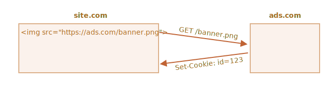

# Cookies, document.cookie

Las cookies son pequeñas cadenas de datos que se almacenan directamente en el navegador. Son parte del protocolo HTTP, definido por la especificación [RFC 6265](https://tools.ietf.org/html/rfc6265).

<<<<<<< HEAD
Las cookies son usualmente establecidos por un servidor web utilizando la cabecera de respuesta HTTP `Set-Cookie`. Entonces, el navegador los agrega automáticamente a (casi) toda solicitud del mismo dominio usando la cabecera HTTP `Cookie`.
=======
Cookies are usually set by a web server using the response `Set-Cookie` HTTP header. Then, the browser automatically adds them to (almost) every request to the same domain using the `Cookie` HTTP header.
>>>>>>> b258d7d5b635c88228f7556e14fbe5e5ca7f736d

Uno de los casos de uso más difundidos es la autenticación:

<<<<<<< HEAD
1. Al  iniciar sesión, el servidor usa la cabecera HTTP `Set-Cookie` en respuesta para establecer una cookie con un "identificador de sesión" único.
2. Al enviar la siguiente solicitud al mismo dominio, el navegador envía la cookie usando la cabecera HTTP `Cookie`.
3. Así el servidor sabe quién hizo la solicitud.
=======
1. Upon sign-in, the server uses the `Set-Cookie` HTTP header in the response to set a cookie with a unique "session identifier".
2. Next time the request is sent to the same domain, the browser sends the cookie over the net using the `Cookie` HTTP header.
3. So the server knows who made the request.
>>>>>>> b258d7d5b635c88228f7556e14fbe5e5ca7f736d

También podemos acceder a las cookies desde el navegador usando la propiedad `document.cookie`.

<<<<<<< HEAD
Hay muchas cosas intrincadas acerca de las cookies y sus opciones. En este artículo las vamos a ver en detalle.
=======
There are many tricky things about cookies and their attributes. In this chapter, we'll cover them in detail.
>>>>>>> b258d7d5b635c88228f7556e14fbe5e5ca7f736d

## Leyendo a document.cookie

```online
¿Puede tu navegador almacenar cookies de este sitio? Veamos:
```

```offline
Asumiendo que estás en un sitio web, es posible ver sus cookies así:
```

```js run
// En javascript.info, usamos Google Analytics para estadísticas,
// así que debería haber algunas cookies
alert( document.cookie ); // cookie1=value1; cookie2=value2;...
```


<<<<<<< HEAD
El valor de `document.cookie` consiste de pares `name=value` delimitados por `; `. Cada uno es una cookie separada.

Para encontrar una cookie particular, podemos separar (split) `document.cookie` por `; ` y encontrar el nombre correcto. Podemos usar tanto una expresión regular como funciones de array para ello.

Lo dejamos como ejercicio para el lector. Al final del artículo encontrarás funciones de ayuda para manipular cookies.
=======
The value of `document.cookie` consists of `name=value` pairs, delimited by `; `. Each one is a separate cookie.

To find a particular cookie, we can split `document.cookie` by `; `, and then find the right name. We can use either a regular expression or array functions to do that.

We leave it as an exercise for the reader. Also, at the end of the chapter, you'll find helper functions to manipulate cookies.
>>>>>>> b258d7d5b635c88228f7556e14fbe5e5ca7f736d

## Escribiendo en document.cookie

Podemos escribir en `document.cookie`. Pero no es una propiedad de datos, es un [accessor (getter/setter)](info:property-accessors). Una asignación a él se trata especialmente.

<<<<<<< HEAD
**Una operación de escritura a `document.cookie` actualiza solo las cookies mencionadas en ella, y no toca las demás.**
=======
**A write operation to `document.cookie` updates only the cookie mentioned in it and doesn't touch other cookies.**
>>>>>>> b258d7d5b635c88228f7556e14fbe5e5ca7f736d

Por ejemplo, este llamado establece una cookie con el nombre `user` y el valor `John`:

```js run
document.cookie = "user=John"; // modifica solo la cookie llamada 'user'
alert(document.cookie); // muestra todas las cookies
```

<<<<<<< HEAD
Si lo ejecutas, probablemente verás múltiples cookies. Esto es porque la operación `document.cookie=` no sobrescribe todas las cookies. Solo configura la cookie mencionada `user`.
=======
If you run it, you will likely see multiple cookies. That's because the `document.cookie=` operation does not overwrite all cookies. It only sets the mentioned cookie `user`.
>>>>>>> b258d7d5b635c88228f7556e14fbe5e5ca7f736d

Técnicamente, nombre y valor pueden tener cualquier carácter. Pero para mantener un formato válido, los caracteres especiales deben escaparse usando la función integrada `encodeURIComponent`:

```js run
<<<<<<< HEAD
// los caracteres especiales (espacios), necesitan codificarse
=======
// special characters (spaces) need encoding
>>>>>>> b258d7d5b635c88228f7556e14fbe5e5ca7f736d
let name = "my name";
let value = "John Smith"

// codifica la cookie como my%20name=John%20Smith
document.cookie = encodeURIComponent(name) + '=' + encodeURIComponent(value);

alert(document.cookie); // ...; my%20name=John%20Smith
```


<<<<<<< HEAD
```warn header="Limitaciones"
Hay algunas limitaciones:
- El par `name=value`, después de `encodeURIComponent`, no debe exceder 4KB. Así que no podemos almacenar algo enorme en una cookie.
- La cantidad total de cookies por dominio está limitada a alrededor de 20+, el límite exacto depende del navegador.
```

Las cookies tienen varias opciones, muchas de ellas importantes y deberían ser configuradas.

Las opciones son listadas después de `key=value`, delimitadas por un `;`:
=======
```warn header="Limitations"
There are a few limitations:
- You can only set/update a single cookie at a time using `document.cookie`.
- The `name=value` pair, after `encodeURIComponent`, should not exceed 4KB. So we can't store anything huge in a cookie.
- The total number of cookies per domain is limited to around 20+, the exact limit depends on the browser.
```

Cookies have several attributes, many of which are important and should be set.

The attributes are listed after `key=value`, delimited by `;`, like this:
>>>>>>> b258d7d5b635c88228f7556e14fbe5e5ca7f736d

```js run
document.cookie = "user=John; path=/; expires=Tue, 19 Jan 2038 03:14:07 GMT"
```

<<<<<<< HEAD
## path 

- **`path=/mypath`**

La ruta del prefijo path debe ser absoluto. Esto hace la cookie accesible a las páginas bajo esa ruta. La forma predeterminada es la ruta actual.

Si una cookie es establecida con `path=/admin`, será visible en las páginas `/admin` y `/admin/something`, pero no en `/home` o `/adminpage`.

Usualmente, debemos configurarlo en la raíz: `path=/` para hacer la cookie accesible a todas las páginas del sitio web.

=======
>>>>>>> b258d7d5b635c88228f7556e14fbe5e5ca7f736d
## domain

- **`domain=site.com`**

Un dominio define dónde la cookie es accesible. Aunque en la práctica hay limitaciones y no podemos configurar cualquier dominio.

**No hay forma de hacer que una cookie sea accesible desde otro dominio de segundo nivel, entonces `other.com` nunca recibirá una cookie establecida en `site.com`.**

Es una restricción de seguridad, para permitirnos almacenar datos sensibles en cookies que deben estar disponibles para un único sitio solamente.

De forma predeterminada, una cookie solo es accesible en el dominio que la establece.

<<<<<<< HEAD
Pero por favor toma nota: de forma predeterminada una cookie tampoco es compartida por un subdominio, como `forum.site.com`.
=======
Please note, by default, a cookie is not shared with a subdomain, such as `forum.site.com`.
>>>>>>> b258d7d5b635c88228f7556e14fbe5e5ca7f736d

```js
// en site.com
document.cookie = "user=John"

// en forum.site.com
alert(document.cookie); // no user
```

...aunque esto puede cambiarse. Si queremos permitir que un subdominio como `forum.site.com` obtenga una cookie establecida por `site.com`, eso es posible.

<<<<<<< HEAD
Para ello, cuando establecemos una cookie en `site.com`, debemos configurar explícitamente la raíz del dominio en la opción `domain`: `domain=site.com`. Entonces todos los subdominios verán la cookie.
=======
For that to happen, when setting a cookie at `site.com`, we should explicitly set the `domain` attribute to the root domain: `domain=site.com`. Then all subdomains will see such a cookie.
>>>>>>> b258d7d5b635c88228f7556e14fbe5e5ca7f736d

Por ejemplo:

```js
// en site.com
// hacer la cookie accesible en cualquier subdominio *.site.com:
document.cookie = "user=John; *!*domain=site.com*/!*"

// ...luego

// en forum.site.com
alert(document.cookie); // tiene la cookie user=John
```

<<<<<<< HEAD
Por razones históricas, `domain=.site.com` (con un punto antes de `site.com`) también funciona de la misma forma, permitiendo acceso a la cookie desde subdominios. Esto es una vieja notación y debe ser usada si necesitamos dar soporte a navegadores muy viejos.

Entonces: la opción `domain` permite que las cookies sean accesibles en los subdominios.

## expires, max-age

De forma predeterminada, si una cookie no tiene una de estas opciones, desaparece cuando el navegador se cierra. Tales cookies se denominan "cookies de sesión".

Para que las cookies sobrevivan al cierre del navegador, podemos usar las opciones `expires` o `max-age`.

- **`expires=Tue, 19 Jan 2038 03:14:07 GMT`**

La fecha de expiración define el momento en que el navegador la borra automáticamente.
=======
```warn header="Legacy syntax"
Historically, `domain=.site.com` (with a dot before `site.com`) used to work the same way, allowing access to the cookie from subdomains. Leading dots in domain names are now ignored, but some browsers may decline to set the cookie containing such dots.
```

To summarize, the `domain` attribute allows to make a cookie accessible at subdomains.

## path

- **`path=/mypath`**

The URL path prefix must be absolute. It makes the cookie accessible for pages under that path. By default, it's the current path.

If a cookie is set with `path=/admin`, it's visible on pages `/admin` and `/admin/something`, but not at `/home`, `/home/admin` or `/`.

Usually, we should set `path` to the root: `path=/` to make the cookie accessible from all website pages. If this attribute is not set the default is calculated using [this method](https://developer.mozilla.org/en-US/docs/Web/HTTP/Cookies#path_default_value).

## expires, max-age

By default, if a cookie doesn't have one of these attributes, it disappears when the browser/tab is closed. Such cookies are called "session cookies"

To let cookies survive a browser close, we can set either the `expires` or `max-age` attribute. `max-Age` has precedence if both are set.

- **`expires=Tue, 19 Jan 2038 03:14:07 GMT`**

The cookie expiration date defines the time when the browser will automatically delete it (according to the browser's time zone).
>>>>>>> b258d7d5b635c88228f7556e14fbe5e5ca7f736d

La fecha debe estar exactamente en ese formato, en el huso horario GMT. Podemos obtenerlo con `date.toUTCString`. Por ejemplo, podemos configurar que la cookie expire en un día:

```js
// +1 día desde ahora
let date = new Date(Date.now() + 86400e3);
date = date.toUTCString();
document.cookie = "user=John; expires=" + date;
```

Si establecemos `expires` en una fecha en el pasado, la cookie es eliminada.

-  **`max-age=3600`**

`max-age` es una alternativa a `expires`, y especifica la expiración de la cookie en segundos desde el momento actual.

Si la configuramos a cero o un valor negativo, la cookie es eliminada:

```js
// la cookie morirá en +1 hora a partir de ahora
document.cookie = "user=John; max-age=3600";

// borra la cookie (la hacemos expirar ya)
document.cookie = "user=John; max-age=0";
```

## secure

- **`secure`**

La cookie debe ser transferida solamente a través de HTTPS.

**De forma predeterminada, si establecemos una cookie en `http://site.com`, entonces también aparece en `https://site.com` y viceversa.**

Esto es, las cookies están basadas en el dominio, no distinguen entre protocolos.

<<<<<<< HEAD
Con la opción `secure`, si una cookie se establece por `https://site.com`, entonces no aparecerá cuando el mismo sitio es accedido por HTTP, como `http://site.com`. Entonces, si una cookie tiene información sensible que nunca debe ser enviada sobre HTTP sin encriptar, debe configurarse `secure`.
=======
With this attribute, if a cookie is set by `https://site.com`, then it doesn't appear when the same site is accessed by HTTP, as `http://site.com`. So if a cookie has sensitive content that should never be sent over unencrypted HTTP, the `secure` flag is the right thing.
>>>>>>> b258d7d5b635c88228f7556e14fbe5e5ca7f736d

```js
// asumiendo que estamos en https:// ahora
// configuramos la cookie para ser segura (solo accesible sobre HTTPS)
document.cookie = "user=John; secure";
```

## samesite

<<<<<<< HEAD
Este es otro atributo de seguridad. `samesite` sirve para proteger contra los ataques llamados XSRF (falsificación de solicitud entre sitios, cross-site request forgery).
=======
This is another security attribute `samesite`. It's designed to protect from so-called XSRF (cross-site request forgery) attacks.
>>>>>>> b258d7d5b635c88228f7556e14fbe5e5ca7f736d

Para entender cómo funciona y su utilidad, veamos primero los ataques XSRF.

### ataque XSRF

<<<<<<< HEAD
Imagina que tienes una sesión en el sitio `bank.com`. Esto es: tienes una cookie de autenticación para ese sitio. Tu navegador lo envía a `bank.com` en cada solicitud, así aquel te reconoce y ejecuta todas las operaciones financieras sensibles.
=======
Imagine, you are logged into the site `bank.com`. That is: you have an authentication cookie from that site. Your browser sends it to `bank.com` with every request so that it recognizes you and performs all sensitive financial operations.
>>>>>>> b258d7d5b635c88228f7556e14fbe5e5ca7f736d

Ahora, mientras navegas la red en otra ventana, accidentalmente entras en otro sitio `evil.com`. Este sitio tiene código JavaScript que envía un formulario `<form action="https://bank.com/pay">` a `bank.com` con los campos que inician una transacción a la cuenta el hacker.

<<<<<<< HEAD
El navegador envía cookies cada vez que visitas el sitio `bank.com`, incluso si el form fue enviado desde `evil.com`. Entonces el banco te reconoce y realmente ejecuta el pago.


Ese es el ataque llamado "Cross-Site Request Forgery" (XSRF).

Los bancos reales están protegidos contra esto por supuesto. Todos los formularios generados por `bank.com` tienen un campo especial, llamado "token de protección XSRF", que una página maliciosa no puede generar o extraer desde una página remota. Puede enviar el form, pero no obtiene respuesta a la solicitud. El sitio `bank.com` verifica tal token en cada form que recibe.
=======
The browser sends cookies every time you visit the site `bank.com`, even if the form was submitted from `evil.com`. So the bank recognizes you and performs the payment.


This is a so-called "Cross-Site Request Forgery" (in short, XSRF) attack.

Real banks are protected from it of course. All forms generated by `bank.com` have a special field, a so-called "XSRF protection token", that an evil page can't generate or extract from a remote page. It can submit a form there, but can't get the data back. The site `bank.com` checks for such a token in every form it receives.
>>>>>>> b258d7d5b635c88228f7556e14fbe5e5ca7f736d

Tal protección toma tiempo para implementarla. Necesitamos asegurarnos de que cada form tiene dicho campo token, y debemos verificar todas las solicitudes.

<<<<<<< HEAD
### Opción de cookie samesite

La opción `samesite` brinda otra forma de proteger tales ataques, que (en teoría) no requiere el "token de protección XSRF".
=======
### Use cookie samesite attribute

The cookie `samesite` attribute provides another way to protect from such attacks, that (in theory) should not require "xsrf protection tokens".
>>>>>>> b258d7d5b635c88228f7556e14fbe5e5ca7f736d

Tiene dos valores posibles:

<<<<<<< HEAD
- **`samesite=strict` (lo mismo que `samesite` sin valor)**
=======
- **`samesite=strict`**
>>>>>>> b258d7d5b635c88228f7556e14fbe5e5ca7f736d

Una cookie con `samesite=strict` nunca es enviada si el usuario viene desde fuera del mismo sitio.

<<<<<<< HEAD
En otras palabras, si el usuario sigue un enlace desde su correo, envía un form desde `evil.com`, o hace cualquier operación originada desde otro dominio, la cookie no será enviada.

Si las cookies de autenticación tienen la opción `samesite`, un ataque XSRF no tiene posibilidad de éxito porque el envío de `evil.com` llega sin cookies. Así `bank.com` no reconoce el usuario y no procederá con el pago.

La protección es muy confiable. Solo las operaciones que vienen de `bank.com` enviarán la cookie `samesite`, por ejemplo un form desde otra página de `bank.com`.
=======
In other words, whether a user follows a link from their email, submits a form from `evil.com`, or does any operation that originates from another domain, the cookie is not sent.

If authentication cookies have the `samesite=strict` attribute, then an XSRF attack has no chance of succeeding, because a submission from `evil.com` comes without cookies. So `bank.com` will not recognize the user and will not proceed with the payment.

The protection is quite reliable. Only operations that come from `bank.com` will send the `samesite=strict` cookie, e.g. a form submission from another page at `bank.com`.
>>>>>>> b258d7d5b635c88228f7556e14fbe5e5ca7f736d

Aunque hay un pequeño inconveniente.

<<<<<<< HEAD
Cuando el usuario sigue un enlace legítimo a `bank.com`, por ejemplo desde sus propio correo, será sorprendido con que `bank.com` no lo reconoce. Efectivamente, las cookies `samesite=strict` no son enviadas en ese caso.

Podemos sortear esto usando dos cookies: una para el "reconocimiento general", con el solo propósito de decir: "Hola, John", y la otra para operaciones de datos con `samesite=strict`. Entonces, la persona que venga desde fuera del sitio llega a la página de bienvenida, pero los pagos serán iniciados desde dentro del sitio web del banco, entonces la segunda cookie sí será enviada.
=======
When a user follows a legitimate link to `bank.com`, like from their notes, they'll be surprised that `bank.com` does not recognize them. Indeed, `samesite=strict` cookies are not sent in that case.

We could work around that by using two cookies: one for "general recognition", only to say: "Hello, John", and the other one for data-changing operations with `samesite=strict`. Then, a person coming from outside of the site will see a welcome, but payments must be initiated from the bank's website, for the second cookie to be sent.
>>>>>>> b258d7d5b635c88228f7556e14fbe5e5ca7f736d

- **`samesite=lax` (same as `samesite` without value)**

Un enfoque más laxo que también protege de ataques XSRF y no afecta la experiencia de usuario.

El modo `lax`, como `strict`, prohíbe al navegador enviar cookies cuando viene desde fuera del sitio, pero agrega una excepción.

Una cookie `samesite=lax` es enviada si se cumplen dos condiciones:
1. El método HTTP es seguro (por ejemplo GET, pero no POST).

<<<<<<< HEAD
    La lista completa de métodos seguros HTTP está en la especificación [RFC7231](https://tools.ietf.org/html/rfc7231). Básicamente son métodos usados para leer, pero no escribir datos. Los que no ejecutan ninguna operación de alteración de datos. Seguir un enlace es siempre GET, el método seguro.
=======
    The full list of safe HTTP methods is in the [RFC7231 specification](https://tools.ietf.org/html/rfc7231#section-4.2.1). These are the methods that should be used for reading, but not writing the data. They must not perform any data-changing operations. Following a link is always GET, the safe method.
>>>>>>> b258d7d5b635c88228f7556e14fbe5e5ca7f736d

2. La operación ejecuta una navegación del más alto nivel (cambia la URL en la barra de dirección del navegador).

<<<<<<< HEAD
    Esto es usualmente verdad, pero si la navegación en ejecutada dentro de un `<iframe>`, entonces no es de alto nivel. Tampoco encajan aquí los métodos JavaScript para solicitudes de red porque no ejecutan ninguna navegación.

Entonces, lo que hace `samesite=lax` es básicamente permitir la operación más común "ir a URL" para obtener cookies. Por ejemplo, abrir un sitio desde la agenda satisface estas condiciones.
=======
    This is usually true, but if the navigation is performed in an `<iframe>`, then it is not top-level. Additionally, JavaScript methods for network requests do not perform any navigation.

So, what `samesite=lax` does, is to allow the most common "go to URL" operation to have cookies. E.g. opening a website link from notes that satisfy these conditions.
>>>>>>> b258d7d5b635c88228f7556e14fbe5e5ca7f736d

Pero cualquier cosa más complicada, como solicitudes de red desde otro sitio, o un "form submit", pierde las cookies.

Si esto es adecuado para ti, entonces agregar `samesite=lax` probablemente no dañe la experiencia de usuario y agrega protección.

<<<<<<< HEAD
Por sobre todo, `samesite` es una excelente opción.
=======
Overall, `samesite` is a great attribute.
>>>>>>> b258d7d5b635c88228f7556e14fbe5e5ca7f736d

Tiene una importante debilidad:

<<<<<<< HEAD
- `samesite` es ignorado (no soportado) por navegadores viejos, de alrededor de 2017.
=======
- `samesite` is ignored (not supported) by very old browsers, the year 2017 or so.
>>>>>>> b258d7d5b635c88228f7556e14fbe5e5ca7f736d

**Así que si solo confiamos en `samesite` para brindar protección, habrá navegadores que serán vulnerables.**

<<<<<<< HEAD
Pero con seguridad podemos usar `samesite`, junto con otras medidas de protección como los tokens xsrf, para agregar una capa adicional de defensa. En el futuro probablemente podamos descartar la necesidad de tokens xsrf.

## httpOnly

Esta opción no tiene nada que ver con JavaScript, pero tenemos que mencionarla para completar la guía.

El servidor web usa la cabecera `Set-Cookie` para establecer la cookie. También puede configurar la opción `httpOnly`.

Esta opción impide a JavaScript el acceso a la cookie. No podemos ver ni manipular tal cookie usando `document.cookie`.

Esto es usado como medida de precaución, para proteger de ciertos ataques donde el hacker inyecta su propio código en una página y espera que el usuario visite esa página. Esto no debería ser posible en absoluto, los hackers bo deberían poder insertar su código en nuestro sitio, pero puede haber bugs que les permite hacerlo.


Normalmente, si eso sucede y el usuario visita una página web con el código JavaScript del hacker, entonces ese código se ejecuta y gana acceso a `document.cookie` con las cookies del usuario conteniendo información de autenticación. Eso es malo.
=======
But we can use `samesite` together with other protection measures, like xsrf tokens, to add a layer of defence and then, in the future, when old browsers die out, we'll probably be able to drop xsrf tokens.

## httpOnly

This attribute has nothing to do with JavaScript, but we have to mention it for completeness.

The web server uses the `Set-Cookie` header to set a cookie. Also, it may set the `httpOnly` attribute.

This attribute forbids any JavaScript access to the cookie. We can't see such a cookie or manipulate it using `document.cookie`.

This is used as a precautionary measure, to protect from certain attacks when a hacker injects his own JavaScript code into a page and waits for a user to visit that page. That shouldn't be possible at all, hackers should not be able to inject their code into our site, but there may be bugs that let them do it.


Normally, if such a thing happens, and a user visits a web-page with a hacker's JavaScript code, then that code executes and gains access to `document.cookie` with user cookies containing authentication information. That's bad.
>>>>>>> b258d7d5b635c88228f7556e14fbe5e5ca7f736d

Pero si una cookie es `httpOnly`, `document.cookie` no la ve y está protegida.

## Apéndice: Funciones de cookies

Aquí hay un pequeño conjunto de funciones para trabajar con cookies, más conveniente que la modificación manual de `document.cookie`.

Existen muchas librerías de cookies para eso, asi que estas son para demostración solamente. Aunque completamente funcionales.

### getCookie(name)

La forma más corta de acceder a una cookie es usar una [expresión regular](info:regular-expressions).

La función `getCookie(name)` devuelve la cookie con el nombre `name` dado:

```js
// devuelve la cookie con el nombre dado,
// o undefined si no la encuentra
function getCookie(name) {
  let matches = document.cookie.match(new RegExp(
    "(?:^|; )" + name.replace(/([\.$?*|{}\(\)\[\]\\\/\+^])/g, '\\$1') + "=([^;]*)"
  ));
  return matches ? decodeURIComponent(matches[1]) : undefined;
}
```

Aquí `new RegExp` se genera dinámicamente para coincidir `; name=<value>`.

Nota que el valor de una cookie está codificado, entonces `getCookie` usa una función integrada `decodeURIComponent` para decodificarla.

### setCookie(name, value, attributes)

Establece el nombre de la cookie `name` al valor dado `value`, con la ruta por defecto `path=/`, y puede ser modificada para agregar otros valores predeterminados:

```js run
function setCookie(name, value, attributes = {}) {

  attributes = {
    path: '/',
<<<<<<< HEAD
    // agregar otros valores predeterminados si es necesario
    ...options
=======
    // add other defaults here if necessary
    ...attributes
>>>>>>> b258d7d5b635c88228f7556e14fbe5e5ca7f736d
  };

  if (attributes.expires instanceof Date) {
    attributes.expires = attributes.expires.toUTCString();
  }

  let updatedCookie = encodeURIComponent(name) + "=" + encodeURIComponent(value);

  for (let attributeKey in attributes) {
    updatedCookie += "; " + attributeKey;
    let attributeValue = attributes[attributeKey];
    if (attributeValue !== true) {
      updatedCookie += "=" + attributeValue;
    }
  }

  document.cookie = updatedCookie;
}

// Ejemplo de uso:
setCookie('user', 'John', {secure: true, 'max-age': 3600});
```

### deleteCookie(name)

Para borrar una cookie, podemos llamarla con una fecha de expiración negativa:

```js
function deleteCookie(name) {
  setCookie(name, "", {
    'max-age': -1
  })
}
```

<<<<<<< HEAD
```warn header="La modificación o eliminación debe usar la misma ruta y dominio"
Por favor nota que cuando alteramos o borramos una cookie debemos usar exactamente el mismo "path" y "domain" que cuando la establecimos.
=======
```warn header="Updating or deleting must use same path and domain"
Please note: when we update or delete a cookie, we should use exactly the same path and domain attributes as when we set it.
>>>>>>> b258d7d5b635c88228f7556e14fbe5e5ca7f736d
```

Completo: [cookie.js](cookie.js).


## Apéndice: Cookies de terceros

Una cookie es llamada "third-party" o "de terceros" si es colocada por un dominio distinto al de la página que el usuario está visitando.

Por ejemplo:
1. Una página en `site.com` carga un banner desde otro sitio: ``.
2. Junto con el banner, el servidor remoto en `ads.com` puede configurar la cabecera `Set-Cookie` con una cookie como `id=1234`. Tal cookie tiene origen en el dominio `ads.com`, y será visible solamente en `ads.com`:

    

3. La próxima vez que se accede a `ads.com`, el servidor remoto obtiene la cookie `id` y reconoce al usuario:

    

4. Lo que es más importante aquí, cuando el usuario cambia de `site.com` a otro sitio `other.com` que también tiene un banner, entonces `ads.com` obtiene la cookie porque pertenece a `ads.com`, reconociendo al visitante y su movimiento entre sitios:

    


Las cookies de terceros son tradicionalmente usados para rastreo y servicios de publicidad (ads) debido a su naturaleza. Ellas están vinculadas al dominio de origen, entonces `ads.com` puede rastrear al mismo usuario a través de diferentes sitios si ellos los acceden.

<<<<<<< HEAD
Naturalmente, a algunos no les gusta ser seguidos, así que los navegadores permiten deshabilitar tales cookies.
=======
Naturally, some people don't like being tracked, so browsers allow them to disable such cookies.
>>>>>>> b258d7d5b635c88228f7556e14fbe5e5ca7f736d

Además, algunos navegadores modernos emplean políticas especiales para tales cookies:
- Safari no permite cookies de terceros en absoluto.
- Firefox viene con una "lista negra" de dominios de terceros y bloquea las cookies de tales orígenes.


```smart
Si cargamos un script desde un dominio de terceros, como `<script src="https://google-analytics.com/analytics.js">`, y ese script usa `document.cookie` para configurar una cookie, tal cookie no es "de terceros".

Si un script configura una cookie, no importa de dónde viene el script: la cookie pertenece al dominio de la página web actual.
```

## Apéndice: GDPR

<<<<<<< HEAD
Este tópico no está relacionado a JavaScript en absoluto, solo es algo para tener en mente cuando configuramos cookies.

Hay una legislación en Europa llamada GDPR que es un conjunto de reglas que fuerza a los sitios web a respetar la privacidad del usuario. Una de estas reglas es requerir un permiso explícito del usuario para el uso de cookies de seguimiento.
=======
This topic is not related to JavaScript at all, it is just something to keep in mind when setting cookies.

There's a legislation in Europe called GDPR, that enforces a set of rules for websites to respect the users' privacy. One of these rules is to require explicit permission for tracking cookies from the user.
>>>>>>> b258d7d5b635c88228f7556e14fbe5e5ca7f736d

Nota que esto solo se refiere a cookies de seguimiento, identificación y autorización.

Así que si queremos configurar una cookie que solo guarda alguna información pero no hace seguimiento ni identificación del usuario, somos libres de hacerlo.

<<<<<<< HEAD
Pero si vamos a configurar una  cookie con una sesión de autenticación o un id de seguimiento, el usuario debe dar su permiso.

Los sitios web generalmente tienen dos variantes para cumplir con el GDPR. Debes de haberlas visto en la web:
=======
But if we are going to set a cookie with an authentication session or a tracking ID, then a user must allow that.

Websites generally have two variants of complying with GDPR. You are likely to have seen them both on the web:
>>>>>>> b258d7d5b635c88228f7556e14fbe5e5ca7f736d

1. Si un sitio web quiere establecer cookies de seguimiento solo para usuarios autenticados.

    Para hacerlo, el form de registro debe tener un checkbox como: "aceptar la política de privacidad" (que describe cómo las cookies son usadas), el usuario debe marcarlo, entonces el sitio web es libre para establecer cookies de autenticación.

2. Si un sitio web quiere establecer cookies de seguimiento a todo visitante.

<<<<<<< HEAD
    Para hacerlo legalmente, el sitio web muestra un mensaje del tipo "pantalla de bienvenida (splash screen)" a los recién llegados que les pide aceptar las cookies. Entonces el sitio web puede configurarlas y les deja ver el contenido. Esto puede ser molesto para el visitante. A nadie le gusta que aparezca una pantalla modal con la obligación de cliquear en ella en lugar del contenido. Pero el GDPR requiere el acuerdo explícito.


El GDPR no trata solo de cookies, también es acerca de otros problemas relacionados a la privacidad, pero eso va más allá de nuestro objetivo.
=======
    To do so legally, a website shows a modal "splash screen" for newcomers and requires them to agree to the cookies. Then the website can set them and let people see the content. That can be disturbing for new visitors though. No one likes to see such "must-click" modal splash screens instead of the content. But GDPR requires an explicit agreement.


GDPR is not only about cookies, it is about other privacy-related issues too, but that is beyond our scope.
>>>>>>> b258d7d5b635c88228f7556e14fbe5e5ca7f736d


## Resumen

<<<<<<< HEAD
`document.cookie` brinda acceso a las cookies.
- la operación de escritura modifica solo cookies mencionadas en ella.
- nombre y valor deben estar codificados.
- Una cookie no debe exceder los 4KB, y están limitadas a unas 20+ cookies por sitio (depende del navegador).

Opciones de Cookie:
- `path=/`, por defecto la ruta actual, hace la cookie visible solo bajo esa ruta.
- `domain=site.com`, por defecto una cookie es visible solo en el dominio actual. Si el domino se establece explícitamente, la cookie se hace visible a los subdominios.
- `expires` o `max-age` configuran el tiempo de expiración de la cookie. Sin ellas la cookie muere cuando el navegador es cerrado.
- `secure` hace la cookie solo para HTTPS.
- `samesite` prohíbe al navegador enviar la cookie a solicitudes que vengan desde fuera del sitio. Esto ayuda a prevenir ataques XSRF.

Adicionalmente:
- Las cookies de terceros pueden estar prohibidas por el navegador, por ejemplo Safari lo hace por defecto.
- Cuando se configuran cookies de seguimiento para ciudadanos de la UE, la regulación GDPR requiere la autorización del usuario.
=======
`document.cookie` provides access to cookies.
- Write operations modify only the cookie mentioned in it.
- Name/value must be encoded.
- One cookie may not exceed 4KB in size. The number of cookies allowed on a domain is around 20+ (varies by browser).

Cookie attributes:
- `path=/`, by default current path, makes the cookie visible only under that path.
- `domain=site.com`, by default a cookie is visible on the current domain only. If the domain is set explicitly, the cookie becomes visible on subdomains.
- `expires` or `max-age` sets the cookie expiration time. Without them, the cookie dies when the browser is closed.
- `secure` makes the cookie HTTPS-only.
- `samesite` forbids the browser to send the cookie with requests coming from outside the site. This helps to prevent XSRF attacks.

Additionally:
- The browser may forbid third-party cookies, e.g. Safari does that by default. There is also work in progress to implement this in Chrome.
- When setting a tracking cookie for EU citizens, GDPR requires to ask for permission.
>>>>>>> b258d7d5b635c88228f7556e14fbe5e5ca7f736d
