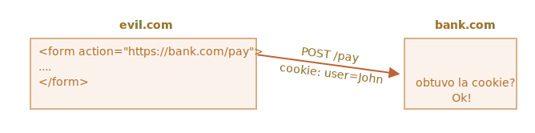

# Cookies, document.cookie

Las cookies son pequeñas cadenas de datos que se almacenan directamente en el navegador. Son parte del protocolo HTTP, definido por la especificación [RFC 6265](https://tools.ietf.org/html/rfc6265).

Las cookies son usualmente establecidos por un servidor web utilizando la cabecera de respuesta HTTP `Set-Cookie`. Entonces, el navegador los agrega automáticamente a (casi) toda solicitud del mismo dominio usando la cabecera HTTP `Cookie`.

Uno de los casos de uso más difundidos es la autenticación:

1. Al  iniciar sesión, el servidor usa la cabecera HTTP `Set-Cookie` en respuesta para establecer una cookie con un "identificador de sesión" único.
2. Al enviar la siguiente solicitud al mismo dominio, el navegador envía la cookie usando la cabecera HTTP `Cookie`.
3. Así el servidor sabe quién hizo la solicitud.

También podemos acceder a las cookies desde el navegador usando la propiedad `document.cookie`.

Hay muchas cosas intrincadas acerca de las cookies y sus opciones. En este artículo las vamos a ver en detalle.

## Leyendo a document.cookie

```online
¿Puede tu navegador almacenar cookies de este sitio? Veamos:
```

```offline
Asumiendo que estás en un sitio web, es posible ver sus cookies así:
```

```js run
// En javascript.info, usamos Google Analytics para estadísticas,
// así que debería haber algunas cookies
alert( document.cookie ); // cookie1=value1; cookie2=value2;...
```


El valor de `document.cookie` consiste de pares `name=value` delimitados por `; `. Cada uno es una cookie separada.

Para encontrar una cookie particular, podemos separar (split) `document.cookie` por `; ` y encontrar el nombre correcto. Podemos usar tanto una expresión regular como funciones de array para ello.

Lo dejamos como ejercicio para el lector. Al final del artículo encontrarás funciones de ayuda para manipular cookies.

## Escribiendo en document.cookie

Podemos escribir en `document.cookie`. Pero no es una propiedad de datos, es un [accessor (getter/setter)](info:property-accessors). Una asignación a él se trata especialmente.

**Una operación de escritura a `document.cookie` actualiza solo las cookies mencionadas en ella, y no toca las demás.**

Por ejemplo, este llamado establece una cookie con el nombre `user` y el valor `John`:

```js run
document.cookie = "user=John"; // modifica solo la cookie llamada 'user'
alert(document.cookie); // muestra todas las cookies
```

Si lo ejecutas, probablemente verás múltiples cookies. Esto es porque la operación `document.cookie=` no sobrescribe todas las cookies. Solo configura la cookie mencionada `user`.

Técnicamente, nombre y valor pueden tener cualquier carácter. Pero para mantener un formato válido, los caracteres especiales deben escaparse usando la función integrada `encodeURIComponent`:

```js run
// los caracteres especiales (espacios), necesitan codificarse
let name = "my name";
let value = "John Smith"

// codifica la cookie como my%20name=John%20Smith
document.cookie = encodeURIComponent(name) + '=' + encodeURIComponent(value);

alert(document.cookie); // ...; my%20name=John%20Smith
```


```warn header="Limitaciones"
Hay algunas limitaciones:
- El par `name=value`, después de `encodeURIComponent`, no debe exceder 4KB. Así que no podemos almacenar algo enorme en una cookie.
- La cantidad total de cookies por dominio está limitada a alrededor de 20+, el límite exacto depende del navegador.
```

Las cookies tienen varias opciones, muchas de ellas importantes y deberían ser configuradas.

Las opciones son listadas después de `key=value`, delimitadas por un `;`:

```js run
document.cookie = "user=John; path=/; expires=Tue, 19 Jan 2038 03:14:07 GMT"
```

## path 

- **`path=/mypath`**

La ruta del prefijo path debe ser absoluto. Esto hace la cookie accesible a las páginas bajo esa ruta. La forma predeterminada es la ruta actual.

Si una cookie es establecida con `path=/admin`, será visible en las páginas `/admin` y `/admin/something`, pero no en `/home` o `/adminpage`.

Usualmente, debemos configurarlo en la raíz: `path=/` para hacer la cookie accesible a todas las páginas del sitio web.

## domain

- **`domain=site.com`**

Un dominio define dónde la cookie es accesible. Aunque en la práctica hay limitaciones y no podemos configurar cualquier dominio.

**No hay forma de hacer que una cookie sea accesible desde otro dominio de segundo nivel, entonces `other.com` nunca recibirá una cookie establecida en `site.com`.**

Es una restricción de seguridad, para permitirnos almacenar datos sensibles en cookies que deben estar disponibles para un único sitio solamente.

De forma predeterminada, una cookie solo es accesible en el dominio que la establece.

Pero por favor toma nota: de forma predeterminada una cookie tampoco es compartida por un subdominio, como `forum.site.com`.

```js
// en site.com
document.cookie = "user=John"

// en forum.site.com
alert(document.cookie); // no user
```

...aunque esto puede cambiarse. Si queremos permitir que un subdominio como `forum.site.com` obtenga una cookie establecida por `site.com`, eso es posible.

Para ello, cuando establecemos una cookie en `site.com`, debemos configurar explícitamente la raíz del dominio en la opción `domain`: `domain=site.com`. Entonces todos los subdominios verán la cookie.

Por ejemplo:

```js
// en site.com
// hacer la cookie accesible en cualquier subdominio *.site.com:
document.cookie = "user=John; *!*domain=site.com*/!*"

// ...luego

// en forum.site.com
alert(document.cookie); // tiene la cookie user=John
```

Por razones históricas, `domain=.site.com` (con un punto antes de `site.com`) también funciona de la misma forma, permitiendo acceso a la cookie desde subdominios. Esto es una vieja notación y debe ser usada si necesitamos dar soporte a navegadores muy viejos.

Entonces: la opción `domain` permite que las cookies sean accesibles en los subdominios.

## expires, max-age

De forma predeterminada, si una cookie no tiene una de estas opciones, desaparece cuando el navegador se cierra. Tales cookies se denominan "cookies de sesión".

Para que las cookies sobrevivan al cierre del navegador, podemos usar las opciones `expires` o `max-age`.

- **`expires=Tue, 19 Jan 2038 03:14:07 GMT`**

La fecha de expiración define el momento en que el navegador la borra automáticamente.

La fecha debe estar exactamente en ese formato, en el huso horario GMT. Podemos obtenerlo con `date.toUTCString`. Por ejemplo, podemos configurar que la cookie expire en un día:

```js
// +1 día desde ahora
let date = new Date(Date.now() + 86400e3);
date = date.toUTCString();
document.cookie = "user=John; expires=" + date;
```

Si establecemos `expires` en una fecha en el pasado, la cookie es eliminada.

-  **`max-age=3600`**

`max-age` es una alternativa a `expires` y especifica la expiración de la cookie en segundos desde el momento actual.

Si la configuramos a cero o un valor negativo, la cookie es eliminada:

```js
// la cookie morirá en +1 hora a partir de ahora
document.cookie = "user=John; max-age=3600";

// borra la cookie (la hacemos expirar ya)
document.cookie = "user=John; max-age=0";
```

## secure

- **`secure`**

La cookie debe ser transferida solamente a través de HTTPS.

**De forma predeterminada, si establecemos una cookie en `http://site.com`, entonces también aparece en `https://site.com` y viceversa.**

Esto es, las cookies están basadas en el dominio, no distinguen entre protocolos.

Con la opción `secure`, si una cookie se establece por `https://site.com`, entonces no aparecerá cuando el mismo sitio es accedido por HTTP, como `http://site.com`. Entonces, si una cookie tiene información sensible que nunca debe ser enviada sobre HTTP sin encriptar, debe configurarse `secure`.

```js
// asumiendo que estamos en https:// ahora
// configuramos la cookie para ser segura (solo accesible sobre HTTPS)
document.cookie = "user=John; secure";
```

## samesite

Este es otro atributo de seguridad. `samesite` sirve para proteger contra los ataques llamados XSRF (falsificación de solicitud entre sitios, cross-site request forgery).

Para entender cómo funciona y su utilidad, veamos primero los ataques XSRF.

### ataque XSRF

Imagina que tienes una sesión en el sitio `bank.com`. Esto es: tienes una cookie de autenticación para ese sitio. Tu navegador lo envía a `bank.com` en cada solicitud, así aquel te reconoce y ejecuta todas las operaciones financieras sensibles.

Ahora, mientras navegas la red en otra ventana, accidentalmente entras en otro sitio `evil.com`. Este sitio tiene código JavaScript que envía un formulario `<form action="https://bank.com/pay">` a `bank.com` con los campos que inician una transacción a la cuenta el hacker.

El navegador envía cookies cada vez que visitas el sitio `bank.com`, incluso si el form fue enviado desde `evil.com`. Entonces el banco te reconoce y realmente ejecuta el pago.



Ese es el ataque llamado "Cross-Site Request Forgery" (XSRF).

Los bancos reales están protegidos contra esto por supuesto. Todos los formularios generados por `bank.com` tienen un campo especial, llamado "token de protección XSRF", que una página maliciosa no puede generar o extraer desde una página remota. Puede enviar el form, pero no obtiene respuesta a la solicitud. El sitio `bank.com` verifica tal token en cada form que recibe.

Tal protección toma tiempo para implementarla. Necesitamos asegurarnos de que cada form tiene dicho campo token, y debemos verificar todas las solicitudes.

### Opción de cookie samesite

La opción `samesite` brinda otra forma de proteger tales ataques, que (en teoría) no requiere el "token de protección XSRF".

Tiene dos valores posibles:

- **`samesite=strict` (lo mismo que `samesite` sin valor)**

Una cookie con `samesite=strict` nunca es enviada si el usuario viene desde fuera del mismo sitio.

En otras palabras, si el usuario sigue un enlace desde su correo, envía un form desde `evil.com`, o hace cualquier operación originada desde otro dominio, la cookie no será enviada.

Si las cookies de autenticación tienen la opción `samesite`, un ataque XSRF no tiene posibilidad de éxito porque el envío de `evil.com` llega sin cookies. Así `bank.com` no reconoce el usuario y no procederá con el pago.

La protección es muy confiable. Solo las operaciones que vienen de `bank.com` enviarán la cookie `samesite`, por ejemplo un form desde otra página de `bank.com`.

Aunque hay un pequeño inconveniente.

Cuando el usuario sigue un enlace legítimo a `bank.com`, por ejemplo desde sus propio correo, será sorprendido con que `bank.com` no lo reconoce. Efectivamente, las cookies `samesite=strict` no son enviadas en ese caso.

Podemos sortear esto usando dos cookies: una para el "reconocimiento general", con el solo propósito de decir: "Hola, John", y la otra para operaciones de datos con `samesite=strict`. Entonces, la persona que venga desde fuera del sitio llega a la página de bienvenida, pero los pagos serán iniciados desde dentro del sitio web del banco, entonces la segunda cookie sí será enviada.

- **`samesite=lax`**

Un enfoque más laxo que también protege de ataques XSRF y no afecta la experiencia de usuario.

El modo `lax`, como `strict`, prohíbe al navegador enviar cookies cuando viene desde fuera del sitio, pero agrega una excepción.

Una cookie `samesite=lax` es enviada si se cumplen dos condiciones:
1. El método HTTP es seguro (por ejemplo GET, pero no POST).

    La lista completa de métodos seguros HTTP está en la especificación [RFC7231](https://tools.ietf.org/html/rfc7231). Básicamente son métodos usados para leer, pero no escribir datos. Los que no ejecutan ninguna operación de alteración de datos. Seguir un enlace es siempre GET, el método seguro.

2. La operación ejecuta una navegación del más alto nivel (cambia la URL en la barra de dirección del navegador).

    Esto es usualmente verdad, pero si la navegación en ejecutada dentro de un `<iframe>`, entonces no es de alto nivel. Tampoco encajan aquí los métodos JavaScript para solicitudes de red porque no ejecutan ninguna navegación.

Entonces, lo que hace `samesite=lax` es básicamente permitir la operación más común "ir a URL" para obtener cookies. Por ejemplo, abrir un sitio desde la agenda satisface estas condiciones.

Pero cualquier cosa más complicada, como solicitudes de red desde otro sitio, o un "form submit", pierde las cookies.

Si esto es adecuado para ti, entonces agregar `samesite=lax` probablemente no dañe la experiencia de usuario y agrega protección.

Por sobre todo, `samesite` es una excelente opción.

Tiene una importante debilidad:

- `samesite` es ignorado (no soportado) por navegadores viejos, de alrededor de 2017.

**Así que si solo confiamos en `samesite` para brindar protección, habrá navegadores que serán vulnerables.**

Pero con seguridad podemos usar `samesite`, junto con otras medidas de protección como los tokens xsrf, para agregar una capa adicional de defensa. En el futuro probablemente podamos descartar la necesidad de tokens xsrf.

## httpOnly

Esta opción no tiene nada que ver con JavaScript, pero tenemos que mencionarla para completar la guía.

El servidor web usa la cabecera `Set-Cookie` para establecer la cookie. También puede configurar la opción `httpOnly`.

Esta opción impide a JavaScript el acceso a la cookie. No podemos ver ni manipular tal cookie usando `document.cookie`.

Esto es usado como medida de precaución, para proteger de ciertos ataques donde el hacker inyecta su propio código en una página y espera que el usuario visite esa página. Esto no debería ser posible en absoluto, los hackers bo deberían poder insertar su código en nuestro sitio, pero puede haber bugs que les permite hacerlo.


Normalmente, si eso sucede y el usuario visita una página web con el código JavaScript del hacker, entonces ese código se ejecuta y gana acceso a `document.cookie` con las cookies del usuario conteniendo información de autenticación. Eso es malo.

Pero si una cookie es `httpOnly`, `document.cookie` no la ve y está protegida.

## Apéndice: Funciones de cookies

Aquí hay un pequeño conjunto de funciones para trabajar con cookies, más conveniente que la modificación manual de `document.cookie`.

Existen muchas librerías de cookies para eso, asi que estas son para demostración solamente. Aunque completamente funcionales.


### getCookie(name)

La forma más corta de acceder a una cookie es usar una [expresión regular](info:regular-expressions).

La función `getCookie(name)` devuelve la cookie con el nombre `name` dado:

```js
// devuelve la cookie con el nombre dado,
// o undefined si no la encuentra
function getCookie(name) {
  let matches = document.cookie.match(new RegExp(
    "(?:^|; )" + name.replace(/([\.$?*|{}\(\)\[\]\\\/\+^])/g, '\\$1') + "=([^;]*)"
  ));
  return matches ? decodeURIComponent(matches[1]) : undefined;
}
```

Aquí `new RegExp` se genera dinámicamente para coincidir `; name=<value>`.

Nota que el valor de una cookie está codificado, entonces `getCookie` usa una función integrada `decodeURIComponent` para decodificarla.

### setCookie(name, value, options)

Establece el nombre de la cookie `name` al valor dado `value`, con la ruta por defecto `path=/`, y puede ser modificada para agregar otros valores predeterminados:

```js run
function setCookie(name, value, options = {}) {

  options = {
    path: '/',
    // agregar otros valores predeterminados si es necesario
    ...options
  };

  if (options.expires instanceof Date) {
    options.expires = options.expires.toUTCString();
  }

  let updatedCookie = encodeURIComponent(name) + "=" + encodeURIComponent(value);

  for (let optionKey in options) {
    updatedCookie += "; " + optionKey;
    let optionValue = options[optionKey];
    if (optionValue !== true) {
      updatedCookie += "=" + optionValue;
    }
  }

  document.cookie = updatedCookie;
}

// Ejemplo de uso:
setCookie('user', 'John', {secure: true, 'max-age': 3600});
```

### deleteCookie(name)

Para borrar una cookie, podemos llamarla con una fecha de expiración negativa:

```js
function deleteCookie(name) {
  setCookie(name, "", {
    'max-age': -1
  })
}
```

```warn header="La modificación o eliminación debe usar la misma ruta y dominio"
Por favor nota que cuando alteramos o borramos una cookie debemos usar exactamente el mismo "path" y "domain" que cuando la establecimos.
```

Completo: [cookie.js](cookie.js).


## Apéndice: Cookies de terceros

Una cookie es llamada "third-party" o "de terceros" si es colocada por un dominio distinto al de la página que el usuario está visitando.

Por ejemplo:
1. Una página en `site.com` carga un banner desde otro sitio: ``.
2. Junto con el banner, el servidor remoto en `ads.com` puede configurar la cabecera `Set-Cookie` con una cookie como `id=1234`. Tal cookie tiene origen en el dominio `ads.com`, y será visible solamente en `ads.com`:

    

3. La próxima vez que se accede a `ads.com`, el servidor remoto obtiene la cookie `id` y reconoce al usuario:

    

4. Lo que es más importante aquí, cuando el usuario cambia de `site.com` a otro sitio `other.com` que también tiene un banner, entonces `ads.com` obtiene la cookie porque pertenece a `ads.com`, reconociendo al visitante y su movimiento entre sitios:

    


Las cookies de terceros son tradicionalmente usados para rastreo y servicios de publicidad (ads) debido a su naturaleza. Ellas están vinculadas al dominio de origen, entonces `ads.com` puede rastrear al mismo usuario a través de diferentes sitios si ellos los acceden.

Naturalmente, a algunos no les gusta ser seguidos, así que los navegadores permiten deshabilitar tales cookies.

Además, algunos navegadores modernos emplean políticas especiales para tales cookies:
- Safari no permite cookies de terceros en absoluto.
- Firefox viene con una "lista negra" de dominios de terceros y bloquea las cookies de tales orígenes.


```smart
Si cargamos un script desde un dominio de terceros, como `<script src="https://google-analytics.com/analytics.js">`, y ese script usa `document.cookie` para configurar una cookie, tal cookie no es "de terceros".

Si un script configura una cookie, no importa de dónde viene el script: la cookie pertenece al dominio de la página web actual.
```

## Apéndice: GDPR

Este tópico no está relacionado a JavaScript en absoluto, solo es algo para tener en mente cuando configuramos cookies.

Hay una legislación en Europa llamada GDPR que es un conjunto de reglas que fuerza a los sitios web a respetar la privacidad del usuario. Una de estas reglas es requerir un permiso explícito del usuario para el uso de cookies de seguimiento.

Nota que esto solo se refiere a cookies de seguimiento, identificación y autorización.

Así que si queremos configurar una cookie que solo guarda alguna información pero no hace seguimiento ni identificación del usuario, somos libres de hacerlo.

Pero si vamos a configurar una  cookie con una sesión de autenticación o un id de seguimiento, el usuario debe dar su permiso.

Los sitios web generalmente tienen dos variantes para cumplir con el GDPR. Debes de haberlas visto en la web:

1. Si un sitio web quiere establecer cookies de seguimiento solo para usuarios autenticados.

    Para hacerlo, el form de registro debe tener un checkbox como: "aceptar la política de privacidad" (que describe cómo las cookies son usadas), el usuario debe marcarlo, entonces el sitio web es libre para establecer cookies de autenticación.

2. Si un sitio web quiere establecer cookies de seguimiento a todo visitante.

    Para hacerlo legalmente, el sitio web muestra un mensaje del tipo "pantalla de bienvenida (splash screen)" a los recién llegados que les pide aceptar las cookies. Entonces el sitio web puede configurarlas y les deja ver el contenido. Esto puede ser molesto para el visitante. A nadie le gusta que aparezca una pantalla modal con la obligación de cliquear en ella en lugar del contenido. Pero el GDPR requiere el acuerdo explícito.


El GDPR no trata solo de cookies, también es acerca de otros problemas relacionados a la privacidad, pero eso va más allá de nuestro objetivo.


## Resumen

`document.cookie` brinda acceso a las cookies.
- la operación de escritura modifica solo cookies mencionadas en ella.
- nombre y valor deben estar codificados.
- Una cookie no debe exceder los 4KB, y están limitadas a unas 20+ cookies por sitio (depende del navegador).

Opciones de Cookie:
- `path=/`, por defecto la ruta actual, hace la cookie visible solo bajo esa ruta.
- `domain=site.com`, por defecto una cookie es visible solo en el dominio actual. Si el domino se establece explícitamente, la cookie se hace visible a los subdominios.
- `expires` o `max-age` configuran el tiempo de expiración de la cookie. Sin ellas la cookie muere cuando el navegador es cerrado.
- `secure` hace la cookie solo para HTTPS.
- `samesite` prohíbe al navegador enviar la cookie a solicitudes que vengan desde fuera del sitio. Esto ayuda a prevenir ataques XSRF.

Adicionalmente:
- Las cookies de terceros pueden estar prohibidas por el navegador, por ejemplo Safari lo hace por defecto.
- Cuando se configuran cookies de seguimiento para ciudadanos de la UE, la regulación GDPR requiere la autorización del usuario.
