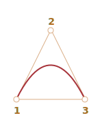
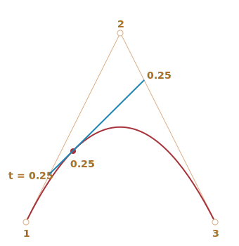

# Curva de Bézier

Las curvas de Bézier se utilizan en gráficos por ordenador para dibujar formas, para animación CSS y en muchos otros lugares.

<<<<<<< HEAD
En realidad, son algo muy sencillo, vale la pena estudiarlos una vez y luego sentirse cómodo en el mundo de los gráficos vectoriales y las animaciones avanzadas.
=======
They are a very simple thing, worth to study once and then feel comfortable in the world of vector graphics and advanced animations.
>>>>>>> a0bfa924a17cad8e7fee213904b27dbf57c2dbac

## Puntos de control

Una [curva de Bézier](https://es.wikipedia.org/wiki/Curva_de_B%C3%A9zier) está definida por puntos de control.

Puede haber 2, 3, 4 o más.

Por ejemplo, curva de dos puntos:


Curva de tres puntos:


Curva de cuatro puntos:


Si observas detenidamente estas curvas, puedes notar inmediatamente que:

1. **Los puntos no siempre están en la curva.** Eso es perfectamente normal, luego veremos cómo se construye la curva.
2. **El orden de la curva es igual al número de puntos menos uno**.
Para dos puntos tenemos una curva lineal (que es una línea recta), para tres puntos -- curva cuadrática (parabólica), para cuatro puntos -- curva cúbica.
3. **Una curva siempre está dentro del [casco convexo](https://en.wikipedia.org/wiki/Convex_hull) de los puntos de control:**

     

Debido a esa última propiedad, en gráficos por ordenador es posible optimizar las pruebas de intersección. Si los cascos convexos no se intersecan, las curvas tampoco. Por tanto, comprobar primero la intersección de los cascos convexos puede dar un resultado "sin intersección" muy rápido.  La comprobación de la intersección o los cascos convexos es mucho más fácil, porque son rectángulos, triángulos, etc. (vea la imagen de arriba), figuras mucho más simples que la curva.

**El valor principal de las curvas de Bézier para dibujar: al mover los puntos, la curva cambia *de manera intuitiva*.**

Intenta mover los puntos de control con el ratón en el siguiente ejemplo:

[iframe src="demo.svg?nocpath=1&p=0,0,0.5,0,0.5,1,1,1" height=370]

**Como puedes observar, la curva se extiende a lo largo de las lineas tangenciales 1 -> 2 y 3 -> 4.**

Después de algo de práctica, se vuelve obvio cómo colocar puntos para obtener la curva necesaria. Y al conectar varias curvas podemos obtener prácticamente cualquier cosa.

Aquí tenemos algunos ejemplos:

  

## Algoritmo de De Casteljau
Hay una fórmula matemática para las curvas de Bézier, pero la veremos un poco más tarde, porque el
[algoritmo de De Casteljau](https://es.wikipedia.org/wiki/Algoritmo_de_De_Casteljau) es idéntico a la definición matemática y muestra visualmente cómo se construye.

Primero veamos el ejemplo de los 3 puntos.

Aquí está la demostración, y la explicación a continuación.

Los puntos de control (1,2 y 3) se pueden mover con el ratón. Presiona el botón "play" para ejecutarlo.

[iframe src="demo.svg?p=0,0,0.5,1,1,0&animate=1" height=370]

**El algoritmo de De Casteljau para construir la curva de Bézier de 3 puntos:**

1. Dibujar puntos de control. En la demostración anterior están etiquetados: `1`, `2`, `3`.
2. Construir segmentos entre los puntos de control 1 -> 2 -> 3. En la demo anterior son <span style="color:#825E28">marrones</span>.
3. El parámetro `t` se mueve de `0` a `1`. En el ejemplo de arriba se usa el paso `0.05`: el bucle pasa por `0, 0.05, 0.1, 0.15, ... 0.95, 1`.

    Para cada uno de estos valores de `t`:

    - En cada segmento <span style="color:#825E28">marrón</span> tomamos un punto ubicado en la distancia proporcional a `t` desde su comienzo. Como hay dos segmentos, tenemos dos puntos.

        Por ejemplo, para `t=0` -- ambos puntos estarán al comienzo de los segmentos, y para `t=0.25` -- en el 25% de la longitud del segmento desde el comienzo, para `t=0.5` -- 50%(el medio), for `t=1` -- al final de los segmentos.

    - Conecta los puntos. En la imagen de abajo el segmento de conexión está pintado de <span style="color:#167490">azul</span>.


| Para `t=0.25`             | Para `t=0.5`            |
| ------------------------ | ---------------------- |
|    |  |

4. Ahora, en el segmento <span style="color:#167490">azul</span>, toma un punto en la distancia proporcional al mismo valor de `t`. Es decir, para `t=0.25` (la imagen de la izquierda) tenemos un punto al final del cuarto izquierdo del segmento, y para `t=0.5` (la imagen de la derecha) -- en la mitad del segmento. En las imágenes de arriba ese punto es <span style="color:red">rojo</span>.

5. Como `t` va de `0` a `1`, cada valor de `t` añade un punto a la curva. El conjunto de tales puntos forma la curva de Bézier. Es rojo y parabólico en las imágenes de arriba.

Este fue el proceso para 3 puntos. Sería lo mismo para 4 puntos.

La demo para 4 puntos (los puntos se pueden mover con el ratón):

[iframe src="demo.svg?p=0,0,0.5,0,0.5,1,1,1&animate=1" height=370]

El algoritmo para 4 puntos:

- Conectar puntos de control por segmentos: 1 -> 2, 2 -> 3, 3 -> 4. Habrá 3 segmentos <span style="color:#825E28">marrones</span>.
- Para cada `t` en el intervalo de `0` a `1`:
    - Tomamos puntos en estos segmentos en la distancia proporcional a `t` desde el principio. Estos puntos están conectados, por lo que tenemos dos <span style="color:#0A0">segmentos verdes</span>.
    - En estos segmentos tomamos puntos proporcionales a `t`. Obtenemos un <span style="color:#167490">segmento azul</span>.
    - En el segmento azul tomamos un punto proporcional a `t`. En el ejemplo anterior es <span style="color:red">rojo</span>.
- Estos puntos juntos forman la curva.

El algoritmo es recursivo y se puede generalizar para cualquier número de puntos de control.

Dados N de puntos de control:

1. Los conectamos para obtener inicialmente N-1 segmentos.
2. Entonces, para cada `t` de `0` a `1`, tomamos un punto en cada segmento en la distancia proporcional a `t` y los conectamos. Habrá N-2 segmentos.
3. Repetimos el paso 2 hasta que solo quede un punto.

Estos puntos forman la curva.

```online
**Ejecuta y pausa los ejemplos para ver claramente los segmentos y cómo se construye la curva.**
```


Una curva que se parece a `y=1/t`:

[iframe src="demo.svg?p=0,0,0,0.75,0.25,1,1,1&animate=1" height=370]

Los puntos de control en zig-zag también funcionan bien:

[iframe src="demo.svg?p=0,0,1,0.5,0,0.5,1,1&animate=1" height=370]

Es posible hacer un bucle:

[iframe src="demo.svg?p=0,0,1,0.5,0,1,0.5,0&animate=1" height=370]

Una curva de Bézier no suave (sí, eso también es posible):

[iframe src="demo.svg?p=0,0,1,1,0,1,1,0&animate=1" height=370]

```online
<<<<<<< HEAD
Si hay algo que no está claro en la descripción del algoritmo, los ejemplos en vivo de arriba muestran cómo se construye la curva.
=======
If there's something unclear in the algorithm description, please look at the live examples above to see how
the curve is built.
>>>>>>> a0bfa924a17cad8e7fee213904b27dbf57c2dbac
```

Como el algoritmo es recursivo, podemos construir curvas de Bézier de cualquier orden, es decir, usando 5, 6 o más puntos de control. Pero en la práctica muchos puntos son menos útiles. Por lo general, tomamos 2-3 puntos, y para líneas complejas pegamos varias curvas juntas. Eso es más simple de desarrollar y calcular.

<<<<<<< HEAD
```smart header="¿Cómo dibujar una curva *a través de* puntos dados?"
Para especificar una curva de Bézier se utilizan puntos de control. Como podemos ver, no están en la curva, excepto el primero y el último.
=======
```smart header="How to draw a curve *through* given points?"
To specify a Bezier curve, control points are used. As we can see, they are not on the curve, except the first and the last ones.
>>>>>>> a0bfa924a17cad8e7fee213904b27dbf57c2dbac

A veces tenemos otra tarea: dibujar una curva *a traves de varios puntos*, de modo que todos ellos estén en una sola curva suave. Esta tarea se llama   [interpolación](https://es.wikipedia.org/wiki/Interpolaci%C3%B3n), y aquí no la cubrimos.

Hay fórmulas matemáticas para tales curvas, por ejemplo el [polinomio de Lagrange](https://es.wikipedia.org/wiki/Interpolaci%C3%B3n_polin%C3%B3mica_de_Lagrange). En gráficos por ordenador la [interpolación de spline](https://en.wikipedia.org/wiki/Spline_interpolation) se usa a menudo para construir curvas suaves que conectan muchos puntos.
```


## Matemáticas

Una curva de Bézier se puede describir usando una fórmula matemática.

Como vimos, en realidad no hay necesidad de saberlo, la mayoría de la gente simplemente dibuja la curva moviendo los puntos con un mouse. Pero si te gustan las matemáticas, aquí están.

Dadas las coordenadas de los puntos de control <code>P<sub>i</sub></code>: el primer punto de control tiene las coordenadas <code>P<sub>1</sub> = (x<sub>1</sub>, y<sub>1</sub>)</code>, el segundo: <code>P<sub>2</sub> = (x<sub>2</sub>, y<sub>2</sub>)</code>, y así sucesivamente, las coordenadas de la curva se describen mediante la ecuación que depende del parámetro `t` del segmento `[0,1]`.

- La fórmula para una curva de 2 puntos: 

    <code>P = (1-t)P<sub>1</sub> + tP<sub>2</sub></code>
- Para 3 puntos de control:

    <code>P = (1−t)<sup>2</sup>P<sub>1</sub> + 2(1−t)tP<sub>2</sub> + t<sup>2</sup>P<sub>3</sub></code>
- Para 4 puntos de control:

    <code>P = (1−t)<sup>3</sup>P<sub>1</sub> + 3(1−t)<sup>2</sup>tP<sub>2</sub>  +3(1−t)t<sup>2</sup>P<sub>3</sub> + t<sup>3</sup>P<sub>4</sub></code>


Estas son las ecuaciones vectoriales. En otras palabras, podemos poner `x` e `y` en lugar de `P` para obtener las coordenadas correspondientes.

Por ejemplo, la curva de 3 puntos está formada por puntos `(x, y)` calculados como:

- <code>x = (1−t)<sup>2</sup>x<sub>1</sub> + 2(1−t)tx<sub>2</sub> + t<sup>2</sup>x<sub>3</sub></code>
- <code>y = (1−t)<sup>2</sup>y<sub>1</sub> + 2(1−t)ty<sub>2</sub> + t<sup>2</sup>y<sub>3</sub></code>

En lugar de <code>x<sub>1</sub>, y<sub>1</sub>, x<sub>2</sub>, y<sub>2</sub>, x<sub>3</sub>, y<sub>3</sub></code> deberíamos poner coordenadas de 3 puntos de control, y luego a medida que te `t` se mueve de `0` a `1`, para cada valor de `t` tendremos `(x,y)` de la curva.

Por ejemplo, si los puntos de control son  `(0,0)`, `(0.5, 1)` y `(1, 0)`, las ecuaciones se convierten en:

- <code>x = (1−t)<sup>2</sup> * 0 + 2(1−t)t * 0.5 + t<sup>2</sup> * 1 = (1-t)t + t<sup>2</sup> = t</code>
- <code>y = (1−t)<sup>2</sup> * 0 + 2(1−t)t * 1 + t<sup>2</sup> * 0 = 2(1-t)t = –t<sup>2</sup> + 2t</code>

Ahora como `t` se ejecuta desde `0` a `1`, el conjunto de valores `(x,y)` para cada `t` forman la curva para dichos puntos de control.

## Resumen

Las curvas de Bézier se definen por sus puntos de control.

Vimos dos definiciones de curvas de Bézier:

<<<<<<< HEAD
1. Utilizando una fórmula matemática.
2. Utilizando un proceso de dibujo: el algoritmo de De Casteljau.
=======
1. Using a drawing process: De Casteljau's algorithm.
2. Using a mathematical formulas.
>>>>>>> a0bfa924a17cad8e7fee213904b27dbf57c2dbac

Buenas propiedades de las curvas de Bezier:

<<<<<<< HEAD
- Podemos dibujar líneas suaves con un ratón moviendo los puntos de control.
- Las formas complejas se pueden construir con varias curvas Bezier.
=======
- We can draw smooth lines with a mouse by moving control points.
- Complex shapes can be made of several Bezier curves.
>>>>>>> a0bfa924a17cad8e7fee213904b27dbf57c2dbac

Uso:

- En gráficos por ordenador, modelado, editores gráficos vectoriales. Las fuentes están descritas por curvas de Bézier.
- En desarrollo web - para gráficos en Canvas y en formato SVG. Por cierto, los ejemplos "en vivo" de arriba están escritos en SVG. En realidad, son un solo documento SVG que recibe diferentes puntos como parámetros. Puede abrirlo en una ventana separada y ver el código fuente: [demo.svg](demo.svg?p=0,0,1,0.5,0,0.5,1,1&animate=1).
- En animación CSS para describir la trayectoria y la velocidad de la animación.
