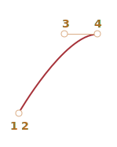

# Animaciones CSS

Las animaciones CSS permiten hacer animaciones simples sin JavaScript en absoluto.

Se puede utilizar JavaScript para controlar la animación CSS y mejorarla con un poco de código.

## Transiciones CSS [#css-transition]

La idea de las transiciones CSS es simple. Describimos una propiedad y cómo se deberían animar sus cambios. Cuando la propiedad cambia, el navegador pinta la animación.

Es decir: todo lo que necesitamos es cambiar la propiedad. Y la transición fluida es realizada por el navegador.

Por ejemplo, el CSS a continuación anima los cambios de `background-color` durante 3 segundos:

```css
.animated {
  transition-property: background-color;
  transition-duration: 3s;
}
```

Ahora, si un elemento tiene la clase `.animated`, cualquier cambio de `background-color` es animado durante 3 segundos.

Haz clic en el botón de abajo para animar el fondo:

```html run autorun height=60
<button id="color">Haz clic en mi</button>

<style>
  #color {
    transition-property: background-color;
    transition-duration: 3s;
  }
</style>

<script>
  color.onclick = function() {
    this.style.backgroundColor = 'red';
  };
</script>
```

Hay 4 propiedades para describir las transiciones CSS:

- `transition-property`
- `transition-duration`
- `transition-timing-function`
- `transition-delay`

Las cubriremos en un momento, por ahora tengamos en cuenta que la propiedad común `transition` permite declararlas juntas en el orden: `property duration timing-function delay`, y también animar múltiples propiedades a la vez.

Por ejemplo, este botón anima tanto `color` como `font-size`:

```html run height=80 autorun no-beautify
<button id="growing">Haz clic en mi</button>

<style>
#growing {
*!*
  transition: font-size 3s, color 2s;
*/!*
}
</style>

<script>
growing.onclick = function() {
  this.style.fontSize = '36px';
  this.style.color = 'red';
};
</script>
```

Ahora cubramos las propiedades de animación una por una.

## transition-property

En `transition-property` escribimos una lista de propiedades para animar, por ejemplo: `left`, `margin-left`, `height`, `color`.

No todas las propiedades pueden ser animadas, pero [muchas de ellas](http://www.w3.org/TR/css3-transitions/#animatable-properties-). El valor `all` significa "animar todas las propiedades".

## transition-duration

En `transition-duration` podemos especificar cuánto tiempo debe durar la animación. El tiempo debe estar en [formato de tiempo CSS](http://www.w3.org/TR/css3-values/#time): en segundos `s` o milisegundos `ms`.

## transition-delay

En `transition-delay` podemos especificar el retraso *antes* de la animación. Por ejemplo, si `transition-delay: 1s`, la animación comienza después de 1 segundo tras el cambio.

Los valores negativos también son posibles. Entonces la animación comienza desde el medio. Por ejemplo, si `transition-duration` es `2s`, y el retraso es `-1s`, entonces la animación toma 1 segundo y comienza desde la mitad.

Aquí la animación cambia los números de `0` a `9` usando la propiedad CSS `translate`:

[codetabs src="digits"]

La propiedad `transform` se anima así:

```css
#stripe.animate {
  transform: translate(-90%);
  transition-property: transform;
  transition-duration: 9s;
}
```

En el ejemplo anterior, JavaScript agrega la clase `.animate` al elemento, y comienza la animación:

```js
stripe.classList.add('animate');
```

También podemos comenzar "desde el medio", desde el número exacto, p. ej. correspondiente al segundo actual, usando el negativo `transition-delay`.

Aquí, si haces clic en el dígito, comienza la animación desde el segundo actual:

[codetabs src="digits-negative-delay"]

JavaScript lo hace por una línea extra:

```js
stripe.onclick = function() {
  let sec = new Date().getSeconds() % 10;
*!*
  // por ejemplo, -3s aquí comienza la animación desde el 3er segundo
  stripe.style.transitionDelay = '-' + sec + 's';
*/!*
  stripe.classList.add('animate');
};
```

## transition-timing-function

La función de temporización describe cómo se distribuye el proceso de animación a lo largo del tiempo. Comenzará lentamente y luego irá rápido o viceversa.

Es la propiedad más complicada a primera vista. Pero se vuelve muy simple si le dedicamos un poco de tiempo.

Esa propiedad acepta dos tipos de valores: una curva de Bézier o pasos. Comencemos por la curva, ya que se usa con más frecuencia.

### Curva de Bézier

La función de temporización se puede establecer como una [curva de Bézier](/bezier-curve) con 4 puntos de control que satisfacen las condiciones:

1. Primer punto de control: `(0,0)`.
2. Último punto de control: `(1,1)`.
3. Para los puntos intermedios, los valores de `x` deben estar en el intervalo `0..1`, `y` puede ser cualquier cosa.

La sintaxis de una curva de Bézier en CSS: `cubic-bezier(x2, y2, x3, y3)`. Aquí necesitamos especificar solo los puntos de control segundo y tercero, porque el primero está fijado a `(0,0)` y el cuarto es `(1,1)`.

La función de temporización describe como de rápido pasa en el tiempo el proceso de animación.

- El eje `x` es el tiempo: `0` -- el momento inicial, `1` -- el último momento de `transition-duration`.
- El eje `y` especifica la finalización del proceso: `0` -- el valor inicial de la propiedad, `1` -- el valor final.

La variante más simple es cuando la animación es uniforme, con la misma velocidad lineal. Eso puede especificarse mediante la curva `cubic-bezier(0, 0, 1, 1)`.

Así es como se ve esa curva:


... Como podemos ver, es solo una línea recta. A medida que pasa el tiempo (`x`), la finalización (`y`) de la animación pasa constantemente de `0` a` 1`.

El tren, en el ejemplo a continuación, va de izquierda a derecha con velocidad constante (haz clic en él):

[codetabs src="train-linear"]

La `transition` de CSS se basa en esa curva:

```css
.train {
  left: 0;
  transition: left 5s cubic-bezier(0, 0, 1, 1);
  /* JavaScript establece left a 450px */
}
```

... ¿Y cómo podemos mostrar un tren desacelerando?

Podemos usar otra curva de Bézier: `cubic-bezier(0.0, 0.5, 0.5, 1.0)`.

La gráfica:


Como podemos ver, el proceso comienza rápido: la curva se eleva mucho, y luego más y más despacio.

Aquí está la función de temporización en acción (haz clic en el tren):

[codetabs src="train"]

CSS:
```css
.train {
  left: 0;
  transition: left 5s cubic-bezier(0, .5, .5, 1);
  /* JavaScript establece left a 450px */
}
```

Hay varias curvas incorporadas: `linear`,` ease`, `ease-in`,` ease-out` y `ease-in-out`.

La `linear` es una abreviatura de `cubic-bezier(0, 0, 1, 1) ` -- una línea recta, como ya vimos.

Otros nombres son abreviaturas para la siguiente `cubic-bezier`:

| <code>ease</code><sup>*</sup> | <code>ease-in</code> | <code>ease-out</code> | <code>ease-in-out</code> |
|-------------------------------|----------------------|-----------------------|--------------------------|
| <code>(0.25, 0.1, 0.25, 1.0)</code> | <code>(0.42, 0, 1.0, 1.0)</code> | <code>(0, 0, 0.58, 1.0)</code> | <code>(0.42, 0, 0.58, 1.0)</code> |
|  |  |  |  |

`*` -- por defecto, si no hay una función de temporización, se utiliza `ease`.

Por lo tanto, podríamos usar `ease-out` para nuestro tren desacelerando:


```css
.train {
  left: 0;
  transition: left 5s ease-out;
  /* transition: left 5s cubic-bezier(0, .5, .5, 1); */
}
```

Pero se ve un poco diferente.

**Una curva de Bézier puede hacer que la animación "salte fuera" de su rango.**

Los puntos de control en la curva pueden tener cualquier coordenada `y`: incluso negativa o enorme. Entonces la curva de Bézier también saltaría muy bajo o alto, haciendo que la animación vaya más allá de su rango normal.

En el siguiente ejemplo, el código de animación es:
```css
.train {
  left: 100px;
  transition: left 5s cubic-bezier(.5, -1, .5, 2);
  /* JavaScript establece left a 400px */
}
```

La propiedad `left` debería animarse de `100px` a `400px`.

Pero si haces clic en el tren, verás que:

- Primero, el tren va *atrás*: `left` llega a ser menor que `100px`.
- Luego avanza, un poco más allá de `400px`.
- Y luego de vuelve a `400px`.

[codetabs src="train-over"]

¿Por qué sucede? es bastante obvio si miramos el gráfico de la curva de Bézier dada:


Movimos la coordenada `y` del segundo punto por debajo de cero, y para el tercer punto lo colocamos sobre `1`, de modo que la curva sale del cuadrante "regular". La `y` está fuera del rango "estándar" `0..1`.

Como sabemos, `y` mide "la finalización del proceso de animación". El valor `y = 0` corresponde al valor inicial de la propiedad e `y = 1` al valor final. Por lo tanto, los valores `y<0` mueven la propiedad por debajo del `left` inicial e `y>1` por encima del `left` final.

Esa es una variante "suave" sin duda. Si ponemos valores `y` como `-99` y `99`, entonces el tren saltaría mucho más fuera del rango.

Pero, ¿cómo hacer la curva de Bézier para una tarea específica? Hay muchas herramientas. Por ejemplo, podemos hacerlo en el sitio <http://cubic-bezier.com/>.

### Pasos

La función de temporización `steps(number of steps[, start/end])` permite dividir la animación en pasos.

Veamos eso en un ejemplo con dígitos.

Aquí tenemos una lista de dígitos, sin animaciones, solo como fuente:

[codetabs src="step-list"]

Haremos que los dígitos aparezcan de manera discreta haciendo invisible la parte de la lista fuera de la "ventana" roja y desplazando la lista a la izquierda con cada paso.

Habrá 9 pasos, un paso para cada dígito:

```css
#stripe.animate  {
  transform: translate(-90%);
  transition: transform 9s *!*steps(9, start)*/!*;
}
```

En acción:

[codetabs src="step"]

El primer argumento de `steps(9, start)` es el número de pasos. La transformación se dividirá en 9 partes (10% cada una). El intervalo de tiempo también se divide automáticamente en 9 partes, por lo que `transition: 9s` nos da 9 segundos para toda la animación: 1 segundo por dígito.

El segundo argumento es una de dos palabras: `start` o `end`.

El `start` significa que al comienzo de la animación debemos hacer el primer paso de inmediato.

Podemos observar eso durante la animación: cuando hacemos clic en el dígito, cambia a `1` (el primer paso) inmediatamente, y luego cambia al comienzo del siguiente segundo.

El proceso está progresando así:

- `0s` -- `-10%` (primer cambio al comienzo del primer segundo, inmediatamente)
- `1s` -- `-20%`
- ...
- `8s` -- `-80%`
- (el último segundo muestra el valor final)

El valor alternativo 'end' significaría que el cambio debe aplicarse no al principio, sino al final de cada segundo.

Entonces el proceso sería así:

- `0s` -- `0`
- `1s` -- `-10%` (primer cambio al final del primer segundo)
- `2s` -- `-20%`
- ...
- `9s` -- `-90%`

Aquí está el `step(9, end)` en acción (observa la pausa entre el primer cambio de dígitos):

[codetabs src="step-end"]

También hay valores abreviados:

- `step-start` -- es lo mismo que` steps(1, start)`. Es decir, la animación comienza de inmediato y toma 1 paso. Entonces comienza y termina inmediatamente, como si no hubiera animación.
- `step-end` -- lo mismo que `steps(1, end)`: realiza la animación en un solo paso al final de `transition-duration`.

Estos valores rara vez se usan, porque eso no es realmente animación, sino un cambio de un solo paso.

## Evento transitionend

Cuando finaliza la animación CSS, se activa el evento `transitionend`.

Es ampliamente utilizado para hacer una acción después de que se realiza la animación. También podemos unir animaciones.

Por ejemplo, el barco en el ejemplo a continuación comienza a navegar ida y vuelta al hacer clic, cada vez más y más a la derecha:

[iframe src="boat" height=300 edit link]

La animación se inicia mediante la función `go` que se vuelve a ejecutar cada vez que finaliza la transición y cambia la dirección:

```js
boat.onclick = function() {
  //...
  let times = 1;

  function go() {
    if (times % 2) {
      // navegar al a derecha
      boat.classList.remove('back');
      boat.style.marginLeft = 100 * times + 200 + 'px';
    } else {
      // navegar a la izquierda
      boat.classList.add('back');
      boat.style.marginLeft = 100 * times - 200 + 'px';
    }

  }

  go();

  boat.addEventListener('transitionend', function() {
    times++;
    go();
  });
};
```

El objeto de evento para `transitionend` tiene pocas propiedades específicas:

`event.propertyName`
: La propiedad que ha terminado de animarse. Puede ser bueno si animamos múltiples propiedades simultáneamente.

`event.elapsedTime`
: El tiempo (en segundos) que duró la animación, sin `transition-delay`.

## Fotogramas clave

Podemos unir múltiples animaciones simples juntas usando la regla CSS `@keyframes`.

Especifica el "nombre" de la animación y las reglas: qué, cuándo y dónde animar. Luego, usando la propiedad `animation`, adjuntamos la animación al elemento y especificamos parámetros adicionales para él.

Aquí tenemos un ejemplo con explicaciones:

```html run height=60 autorun="no-epub" no-beautify
<div class="progress"></div>

<style>
*!*
  @keyframes go-left-right {        /* dale un nombre: "go-left-right" */
    from { left: 0px; }             /* animar desde la izquierda: 0px */
    to { left: calc(100% - 50px); } /* animar a la izquierda: 100%-50px */
  }
*/!*

  .progress {
*!*
    animation: go-left-right 3s infinite alternate;
    /* aplicar la animación "go-left-right" al elemento
       duración 3 segundos
       número de veces: infinitas
       alternar la dirección cada vez
    */
*/!*

    position: relative;
    border: 2px solid green;
    width: 50px;
    height: 20px;
    background: lime;
  }
</style>
```

Hay muchos artículos sobre `@keyframes` y una [especificación detallada](https://drafts.csswg.org/css-animations/).

Probablemente no necesitarás `@keyframes` a menudo, a menos que todo esté en constante movimiento en tus sitios.

## Resumen

Las animaciones CSS permiten animar suavemente (o no) los cambios de una o varias propiedades CSS.

Son buenas para la mayoría de las tareas de animación. También podemos usar JavaScript para animaciones, el siguiente capítulo está dedicado a eso.

Limitaciones de las animaciones CSS en comparación con las animaciones JavaScript:

```comparar más="Animaciones CSS" menos="Animaciones JavaScript"
+ Cosas simples hechas simplemente.
+ Rápido y ligero para la CPU.
- Las animaciones de JavaScript son flexibles. Pueden implementar cualquier lógica de animación, como una "explosión" de un elemento.
- No solo cambios de propiedad. Podemos crear nuevos elementos en JavaScript para fines de animación.
```

La mayoría de las animaciones se pueden implementar usando CSS como se describe en este capítulo. Y el evento `transitionend` permite ejecutar JavaScript después de la animación, por lo que se integra bien con el código.

Pero en el próximo capítulo haremos algunas animaciones en JavaScript para cubrir casos más complejos.
