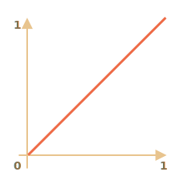
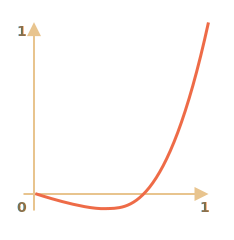
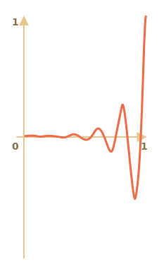
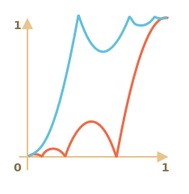

# Animaciones JavaScript

Las animaciones de JavaScript pueden manejar cosas que CSS no puede.

Por ejemplo, moverse a lo largo de una ruta compleja, con una función de sincronización diferente a las curvas de Bézier, o una animación en un canvas.

## Usando setInterval

Una animación se puede implementar como una secuencia de frames, generalmente pequeños cambios en las propiedades de HTML/CSS.

Por ejemplo, cambiar `style.left` de `0px` a `100px` mueve el elemento. Y si lo aumentamos en `setInterval`, cambiando en `2px` con un pequeño retraso, como 50 veces por segundo, entonces se ve suave. Ese es el mismo principio que en el cine: 24 frames por segundo son suficientes para que se vea suave.

El pseudocódigo puede verse así:

```js
let timer = setInterval(function() {
  if (animation complete) clearInterval(timer);
  else increase style.left by 2px
}, 20); // cambiar en 2px cada 20ms, aproximadamente 50 frames por segundo
```

Ejemplo más completo de la animación:

```js
let start = Date.now(); // recordar la hora de inicio

let timer = setInterval(function() {
  // ¿Cuánto tiempo pasó desde el principio?
  let timePassed = Date.now() - start;

  if (timePassed >= 2000) {
    clearInterval(timer); // terminar la animación después de 2 segundos
    return;
  }

  // dibujar la animación en el momento timePassed
  draw(timePassed);

}, 20);

// mientras timePassed va de 0 a 2000
// left obtiene valores de 0px a 400px
function draw(timePassed) {
  train.style.left = timePassed / 5 + 'px';
}
```

Haz clic para ver la demostración:

[codetabs height=200 src="move"]

## Usando requestAnimationFrame

Imaginemos que tenemos varias animaciones ejecutándose simultáneamente.

Si las ejecutamos por separado, aunque cada una tenga `setInterval (..., 20)`, el navegador tendría que volver a pintar con mucha más frecuencia que cada `20ms`.

Eso es porque tienen un tiempo de inicio diferente, por lo que "cada 20ms" difiere entre las diferentes animaciones. Los intervalos no están alineados. Así que tendremos varias ejecuciones independientes dentro de `20ms`.

En otras palabras, esto:

```js
setInterval(function() {
  animate1();
  animate2();
  animate3();
}, 20)
```

...Es más ligero que tres llamadas independientes:

```js
setInterval(animate1, 20); // animaciones independientes
setInterval(animate2, 20); // en diferentes lugares del script
setInterval(animate3, 20);
```

Estos varios redibujos independientes deben agruparse para facilitar el redibujado al navegador y, por lo tanto, cargar menos CPU y verse más fluido.

Hay una cosa más a tener en cuenta. A veces, cuando el CPU está sobrecargado, o hay otras razones para volver a dibujar con menos frecuencia (como cuando la pestaña del navegador está oculta), no deberíamos ejecutarlo cada `20ms`.

Pero, ¿cómo sabemos eso en JavaScript? Hay una especificación [Sincronización de animación](http://www.w3.org/TR/animation-timing/) que proporciona la función `requestAnimationFrame`. Aborda todos estos problemas y aún más.

La sintaxis:
```js
let requestId = requestAnimationFrame(callback)
```

Eso programa la función `callback` para que se ejecute en el tiempo más cercano cuando el navegador quiera hacer una animación.

Si hacemos cambios en los elementos dentro de `callback`, entonces se agruparán con otros callbacks de `requestAnimationFrame` y con animaciones CSS. Así que habrá un recálculo y repintado de geometría en lugar de muchos.

El valor devuelto `requestId` se puede utilizar para cancelar la llamada:
```js
// cancelar la ejecución programada del callback
cancelAnimationFrame(requestId);
```

El `callback` obtiene un argumento: el tiempo transcurrido desde el inicio de la carga de la página en microsegundos. Este tiempo también se puede obtener llamando a [performance.now()](https://developer.mozilla.org/es/docs/Web/API/Performance/now).

Por lo general, el `callback` se ejecuta muy pronto, a menos que el CPU esté sobrecargado o la batería de la laptop esté casi descargada, o haya otra razón.

El siguiente código muestra el tiempo entre las primeras 10 ejecuciones de `requestAnimationFrame`. Por lo general, son 10-20ms:

```html run height=40 refresh
<script>
  let prev = performance.now();
  let times = 0;

  requestAnimationFrame(function measure(time) {
    document.body.insertAdjacentHTML("beforeEnd", Math.floor(time - prev) + " ");
    prev = time;

    if (times++ < 10) requestAnimationFrame(measure);
  })
</script>
```

## Animación estructurada

Ahora podemos hacer una función de animación más universal basada en `requestAnimationFrame`:

```js
function animate({timing, draw, duration}) {

  let start = performance.now();

  requestAnimationFrame(function animate(time) {
    // timeFraction va de 0 a 1
    let timeFraction = (time - start) / duration;
    if (timeFraction > 1) timeFraction = 1;

    // calcular el estado actual de la animación
    let progress = timing(timeFraction)

    draw(progress); // dibujar

    if (timeFraction < 1) {
      requestAnimationFrame(animate);
    }

  });
}
```

La función `animate` acepta 3 parámetros que básicamente describen la animación:

`duration`
: Tiempo total de animación. Como: `1000`.

`timing(timeFraction)`
: Función de sincronización, como la propiedad CSS `transition-timing-function` que obtiene la fracción de tiempo que pasó (`0` al inicio, `1` al final) y devuelve la finalización de la animación (como `y` en la curva de Bézier).

    Por ejemplo, una función lineal significa que la animación continúa uniformemente con la misma velocidad:

    ```js
    function linear(timeFraction) {
      return timeFraction;
    }
    ```

    Su gráfico:
    

    Eso es como `transition-timing-function: linear`. A continuación se muestran variantes más interesantes.

`draw(progress)`
: La función que toma el estado de finalización de la animación y la dibuja. El valor `progress=0` denota el estado inicial de la animación y `progress=1` -- el estado final.

    Esta es la función que realmente dibuja la animación.

    Puede mover el elemento:
    ```js
    function draw(progress) {
      train.style.left = progress + 'px';
    }
    ```

    ...O hacer cualquier otra cosa, podemos animar cualquier cosa, de cualquier forma.


Vamos a animar el elemento `width` de `0` a `100%` usando nuestra función.

Haz clic en el elemento de la demostración:

[codetabs height=60 src="width"]

El código para ello:

```js
animate({
  duration: 1000,
  timing(timeFraction) {
    return timeFraction;
  },
  draw(progress) {
    elem.style.width = progress * 100 + '%';
  }
});
```

A diferencia de la animación CSS, aquí podemos hacer cualquier función de sincronización y cualquier función de dibujo. La función de sincronización no está limitada por las curvas de Bézier. Y `draw` puede ir más allá de las propiedades, crear nuevos elementos para la animación de fuegos artificiales o algo así.

## Funciones de sincronización

Vimos arriba la función de sincronización lineal más simple.

Veamos más de ellas. Intentaremos animaciones de movimiento con diferentes funciones de sincronización para ver cómo funcionan.

### Potencia de n

Si queremos acelerar la animación, podemos usar `progress` en la potencia `n`.

Por ejemplo, una curva parabólica:

```js
function quad(timeFraction) {
  return Math.pow(timeFraction, 2)
}
```

La gráfica:


Velo en acción (haz clic para activar):

[iframe height=40 src="quad" link]

...O la curva cúbica o incluso mayor `n`. Aumentar la potencia hace que se acelere más rápido.

Aquí está el gráfico de `progress` en la potencia `5`:


En acción:

[iframe height=40 src="quint" link]

### El arco

Función:

```js
function circ(timeFraction) {
  return 1 - Math.sin(Math.acos(timeFraction));
}
```

La gráfica:


[iframe height=40 src="circ" link]

### Back: tiro con arco

Esta función realiza el "tiro con arco". Primero "tiramos de la cuerda del arco", y luego "disparamos".

A diferencia de las funciones anteriores, depende de un parámetro adicional `x`, el "coeficiente de elasticidad". La distancia de "tirar de la cuerda del arco" está definida por él.

El código:

```js
function back(x, timeFraction) {
  return Math.pow(timeFraction, 2) * ((x + 1) * timeFraction - x)
}
```

**The graph for `x = 1.5`:**



Para la animación lo usamos con un valor específico de `x`. Ejemplo de `x = 1.5`:

[iframe height=40 src="back" link]

### Rebotar

Imagina que dejamos caer una pelota. Se cae, luego rebota unas cuantas veces y se detiene.

La función `bounce` hace lo mismo, pero en orden inverso: el "rebote" comienza inmediatamente. Utiliza algunos coeficientes especiales para eso:

```js
function bounce(timeFraction) {
  for (let a = 0, b = 1; 1; a += b, b /= 2) {
    if (timeFraction >= (7 - 4 * a) / 11) {
      return -Math.pow((11 - 6 * a - 11 * timeFraction) / 4, 2) + Math.pow(b, 2)
    }
  }
}
```

En acción:

[iframe height=40 src="bounce" link]

### Animación elástica

Una función "elástica" más que acepta un parámetro adicional `x` para el "rango inicial".

```js
function elastic(x, timeFraction) {
  return Math.pow(2, 10 * (timeFraction - 1)) * Math.cos(20 * Math.PI * x / 3 * timeFraction)
}
```

**La gráfica para `x=1.5`:**


En acción para `x=1.5`:

[iframe height=40 src="elastic" link]

## Inversión: ease*

Entonces tenemos una colección de funciones de sincronización. Su aplicación directa se llama "easyIn".

A veces necesitamos mostrar la animación en orden inverso. Eso se hace con la transformación "easyOut".

### easeOut

En el modo "easyOut", la función `de sincronización` se coloca en un wrapper `timingEaseOut`:

```js
timingEaseOut(timeFraction) = 1 - timing(1 - timeFraction)
```

En otras palabras, tenemos una función de "transformación" `makeEaseOut` que toma una función de sincronización "regular" y devuelve el wrapper envolviéndola:

```js
// acepta una función de sincronización, devuelve la variante transformada
function makeEaseOut(timing) {
  return function(timeFraction) {
    return 1 - timing(1 - timeFraction);
  }
}
```

Por ejemplo, podemos tomar la función `bounce` descrita anteriormente y aplicarla:

```js
let bounceEaseOut = makeEaseOut(bounce);
```

Entonces el rebote no estará al principio, sino al final de la animación. Se ve aún mejor:

[codetabs src="bounce-easeout"]

Aquí podemos ver cómo la transformación cambia el comportamiento de la función:



Si hay un efecto de animación al principio, como rebotar, se mostrará al final.

En el gráfico anterior, el <span style="color:#EE6B47">rebote regular</span> tiene el color rojo y el <span style="color:#62C0DC">rebote easyOut</span> es azul.

- Rebote regular: el objeto rebota en la parte inferior y luego, al final, salta bruscamente hacia la parte superior.
- Después de `easyOut` -- primero salta a la parte superior, luego rebota allí.

### easeInOut

También podemos mostrar el efecto tanto al principio como al final de la animación. La transformación se llama "easyInOut".

Dada la función de tiempo, calculamos el estado de la animación de la siguiente manera:

```js
if (timeFraction <= 0.5) { // primera mitad de la animación
  return timing(2 * timeFraction) / 2;
} else { // segunda mitad de la animación
  return (2 - timing(2 * (1 - timeFraction))) / 2;
}
```

El código wrapper:

```js
function makeEaseInOut(timing) {
  return function(timeFraction) {
    if (timeFraction < .5)
      return timing(2 * timeFraction) / 2;
    else
      return (2 - timing(2 * (1 - timeFraction))) / 2;
  }
}

bounceEaseInOut = makeEaseInOut(bounce);
```

En acción, `bounceEaseInOut`:

[codetabs src="bounce-easeinout"]

La transformación "easyInOut" une dos gráficos en uno: `easyIn` (regular) para la primera mitad de la animación y `easyOut` (invertido) -- para la segunda parte.

El efecto se ve claramente si comparamos las gráficas de `easyIn`, `easyOut` y `easyInOut` de la función de sincronización `circ`:


- <span style="color:#EE6B47">Rojo</span> es la variante regular de `circ` (`easeIn`).
- <span style="color:#8DB173">Verde</span> -- `easeOut`.
- <span style="color:#62C0DC">Azul</span> -- `easeInOut`.

Como podemos ver, el gráfico de la primera mitad de la animación es el `easyIn` reducido y la segunda mitad es el `easyOut` reducido. Como resultado, la animación comienza y termina con el mismo efecto.

## "Dibujar" más interesante

En lugar de mover el elemento podemos hacer otra cosa. Todo lo que necesitamos es escribir la función `draw` adecuada.

Aquí está la escritura de texto animada "rebotando":

[codetabs src="text"]

## Resumen

Para animaciones que CSS no puede manejar bien, o aquellas que necesitan un control estricto, JavaScript puede ayudar. Las animaciones de JavaScript deben implementarse a través de `requestAnimationFrame`. Ese método integrado permite configurar una función callback para que se ejecute cuando el navegador esté preparando un repintado. Por lo general, es muy pronto, pero el tiempo exacto depende del navegador.

Cuando una página está en segundo plano, no se repinta en absoluto, por lo que el callback no se ejecutará: la animación se suspenderá y no consumirá recursos. Eso es genial.

Aquí está la función auxiliar `animate` para configurar la mayoría de las animaciones:

```js
function animate({timing, draw, duration}) {

  let start = performance.now();

  requestAnimationFrame(function animate(time) {
    // timeFraction va de 0 a 1
    let timeFraction = (time - start) / duration;
    if (timeFraction > 1) timeFraction = 1;

    // calcular el estado actual de la animación
    let progress = timing(timeFraction);

    draw(progress); // dibujar

    if (timeFraction < 1) {
      requestAnimationFrame(animate);
    }

  });
}
```

Opciones:

- `duration` -- el tiempo total de animación en ms.
- `timing` -- la función para calcular el progreso de la animación. Obtiene una fracción de tiempo de 0 a 1, devuelve el progreso de la animación, generalmente de 0 a 1.
- `draw` -- la función para dibujar la animación.

Seguramente podríamos mejorarlo, agregar más campanas y silbidos, pero las animaciones de JavaScript no se aplican a diario. Se utilizan para hacer algo interesante y no estándar. Por lo tanto, querrás agregar las funciones que necesitas cuando las necesites.

Las animaciones JavaScript pueden utilizar cualquier función de sincronización. Cubrimos muchos ejemplos y transformaciones para hacerlos aún más versátiles. A diferencia de CSS, aquí no estamos limitados a las curvas de Bézier.

Lo mismo ocurre con `draw`: podemos animar cualquier cosa, no solo propiedades CSS.
