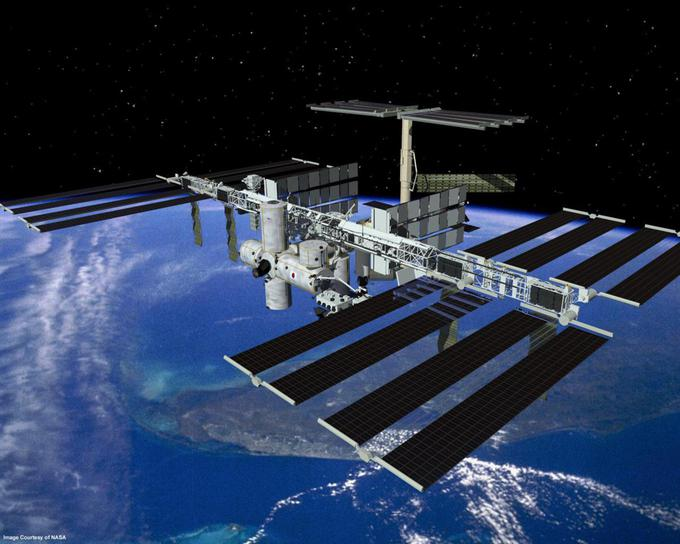
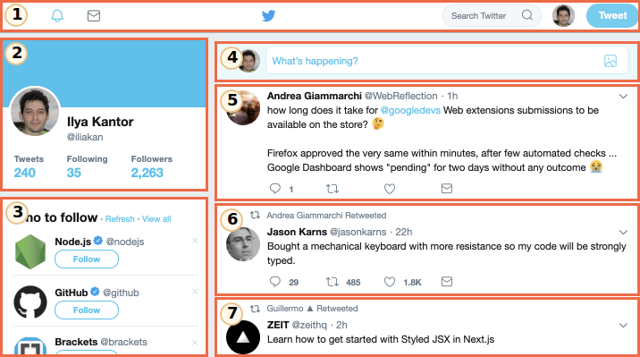

# Desde la altura orbital

En esta sección se describe un conjunto de normas modernas para los "web components".

En la actualidad, estos estándares están en desarrollo. Algunas características están bien apoyadas e integradas en el standard moderno HTML/DOM, mientras que otras están aún en fase de borrador. Puedes probar algunos ejemplos en cualquier navegador, Google Chrome es probablemente el que más actualizado esté con estas características. Suponemos que eso se debe a que los compañeros de Google están detrás de muchas de las especificaciones relacionadas.

## Lo que es común entre...

La idea del componente completo no es nada nuevo. Se usa en muchos frameworks y en otros lugares.

Antes de pasar a los detalles de implementación, echemos un vistazo a este gran logro de la humanidad:

Esa es la Estación Espacial Internacional (EEI).

Y así es como se ha montado (aproximadamente):

La Estación Espacial Internacional:
- Está formada por muchos componentes.
- Cada componente, a su vez, tiene muchos detalles más pequeños en su interior.
- Los componentes son muy complejos, mucho más complicados que la mayoría de los sitios web.
- Los componentes han sido desarrollados internacionalmente, por equipos de diferentes países, que hablan diferentes idiomas.

...Y esta cosa vuela, ¡mantiene a los humanos vivos en el espacio!

¿Cómo se crean dispositivos tan complejos?

¿Qué principios podríamos tomar prestados para que nuestro desarrollo sea fiable y escalable a ese nivel? ¿O, al menos, cerca de él?

## Arquitectura de componentes

La regla más conocida para desarrollar software complejo es: no hacer software complejo.

Si algo se vuelve complejo -- divídelo en partes más simples y conéctalas de la manera más obvia.

**Un buen arquitecto es el que puede hacer lo complejo simple.**

Podemos dividir la interfaz de usuario en componentes visuales: cada uno de ellos tiene su propio lugar en la página, puede "hacer" una tarea bien descrita, y está separado de los demás.

Echemos un vistazo a un sitio web, por ejemplo Twitter.

Naturalmente está divido en componentes:

1. Navegación superior.
2. Información usuario.
3. Sugerencias de seguimiento.
4. Envío de formulario.
5. (y también 6, 7) -- mensajes.

Los componentes pueden tener subcomponentes, p.ej. los mensajes pueden ser parte de un componente "lista de mensajes" de nivel superior. Una imagen de usuario en sí puede ser un componente, y así sucesivamente.

¿Cómo decidimos qué es un componente? Eso viene de la intuición, la experiencia y el sentido común. Normalmente es una entidad visual separada que podemos describir en términos de lo que hace y cómo interactúa con la página. En el caso anterior, la página tiene bloques, cada uno de ellos juega su propio papel, es lógico crear esos componentes.

Un componente tiene:
- Su propia clase de JavaScript.
- La estructura DOM, gestionada únicamente por su clase, el código externo no accede a ella (principio de  "encapsulación").
- Estilos CSS, aplicados al componente.
- API: eventos, métodos de clase etc, para interactuar con otros componentes.

Una vez más, todo el asunto del "componente" no es nada especial.

Existen muchos frameworks y metodologías de desarrollos para construirlos, cada uno con sus propias características y reglas. Normalmente, se utilizan clases y convenciones CSS para proporcionar la "sensación de componente" -- alcance de CSS y encapsulación de DOM.

"Web components" proporcionan capacidades de navegación incorporadas para eso, así que ya no tenemos que emularlos.

- [Custom elements](https://html.spec.whatwg.org/multipage/custom-elements.html#custom-elements) -- para definir elementos HTML personalizados.
- [Shadow DOM](https://dom.spec.whatwg.org/#shadow-trees) -- para crear un DOM interno para el componente, oculto a los demás componentes.
- [CSS Scoping](https://drafts.csswg.org/css-scoping/) -- para declarar estilos que sólo se aplican dentro del Shadow DOM del componente.
- [Event retargeting](https://dom.spec.whatwg.org/#retarget) y otras cosas menores para hacer que los componentes se ajusten mejor al desarrollo.

En el próximo capítulo entraremos en detalles en los "Custom Elements" -- la característica fundamental y bien soportada de los componentes web, buena por sí misma.
