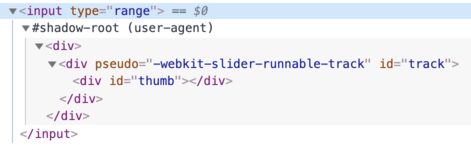

# Shadow DOM

Shadow DOM sirve para el encapsulamiento. Le permite a un componente tener su propio árbol DOM oculto, que no puede ser accedido por accidente desde el documento principal, puede tener reglas de estilo locales, y más.

## Shadow DOM incorporado

¿Alguna vez pensó cómo los controles complejos del navegador se crean y se les aplica estilo?

Tales como `<input type="range">`:

<p>
<input type="range">
</p>

El navegador usa DOM/CSS internamente para dibujarlos. Esa estructura DOM normalmente está oculta para nosotros, pero podemos verla con herramientas de desarrollo. Por ejemplo, en Chrome, necesitamos habilitar la opción "Show user agent shadow DOM" en las herramientas de desarrollo.

Entonces `<input type="range">` se ve algo así:



Lo que ves bajo `#shadow-root` se llama "shadow DOM".

No podemos obtener los elementos de shadow DOM incorporados con llamadas normales a JavaScript o selectores. Estos no son hijos normales sino una poderosa técnica de encapsulamiento.

En el ejemplo de abajo podemos ver un útil atributo `pseudo`. No es estándar, existe por razones históricas. Podemos usarlo para aplicar estilo a subelementos con CSS como aquí:

```html run autorun
<style>
/* hace el control deslizable rojo */
input::-webkit-slider-runnable-track {
  background: red;
}
</style>

<input type="range">
```

De nuevo: `pseudo` no es un atributo estándar. Cronológicamente, los navegadores primero comenzaron a experimentar con estructuras DOM internas para implementar controles, y luego, con el tiempo, fue estandarizado shadow DOM que nos permite, a nosotros desarrolladores, hacer algo similar.

Seguidamente usaremos el moderno estándar shadow DOM cubierto en la [especificación DOM](https://dom.spec.whatwg.org/#shadow-trees).

## Shadow tree (árbol oculto)

Un elemento DOM puede tener dos tipos de subárboles DOM:

1. Light tree -- un subárbol normal, hecho de hijos HTML. Todos los subárboles vistos en capítulos previos eran "light".
2. Shadow tree -- un subárbol shadow DOM, no reflejado en HTML, oculto a la vista.

Si un elemento tiene ambos, el navegador solamente construye el árbol shadow. Pero también podemos establecer un tipo de composición entre árboles shadow y light. Veremos los detalles en el capítulo <info:slots-composition>.

El árbol shadow puede ser usado en elementos personalizados para ocultar los componentes internos y aplicarles estilos locales.

Por ejemplo, este elemento `<show-hello>` oculta su DOM interno en un shadow tree:

```html run autorun height=60
<script>
customElements.define('show-hello', class extends HTMLElement {
  connectedCallback() {
    const shadow = this.attachShadow({mode: 'open'});
    shadow.innerHTML = `<p>
      Hello, ${this.getAttribute('name')}
    </p>`;
  }  
});
</script>

<show-hello name="John"></show-hello>
```

Así es como el DOM resultante se ve en las herramientas de desarrollador de Chrome, todo el contenido está bajo "#shadow-root":


Primero, el llamado a `elem.attachShadow({mode: …})` crea un árbol shadow.

Hay dos limitaciones:
1. Podemos crear solamente una raíz shadow por elemento.
2. `elem` debe ser: o bien un elemento personalizado, o uno de: "article", "aside", "blockquote", "body", "div", "footer", "h1..h6", "header", "main" "nav", "p", "section", o "span". Otros elementos, como ``, no pueden contener un árbol shadow.

La opción `mode` establece el nivel de encapsulamiento. Debe tener uno de estos dos valores:
- `"open"` -- Abierto: la raíz shadow está disponible como `elem.shadowRoot`.

    Todo código puede acceder el árbol shadow de `elem`.   
- `"closed"` -- Cerrado: `elem.shadowRoot` siempre es `null`.

    Solamente podemos acceder al shadow DOM por medio de la referencia devuelta por `attachShadow` (y probablemente oculta dentro de un class). Árboles shadow nativos del navegador, tales como `<input type="range">`, son "closed". No hay forma de accederlos.

La raíz [shadow root](https://dom.spec.whatwg.org/#shadowroot), devuelta por `attachShadow`, es como un elemento: podemos usar `innerHTML` o métodos DOM tales como `append` para llenarlo.

El elemento con una raíz shadow es llamado "shadow tree host" (anfitrión de árbol shadow), y está disponible como la propiedad `host` de shadow root:

```js
// asumimos {mode: "open"}, de otra forma elem.shadowRoot sería null
alert(elem.shadowRoot.host === elem); // true
```

## Encapsulamiento

Shadow DOM está fuertemente delimitado del documento principal "main document":

1. Los elementos Shadow DOM no son visibles para `querySelector` desde el DOM visible (light DOM). En particular,  los elementos Shadow DOM pueden tener ids en conflicto con aquellos en el DOM visible. Estos deben ser únicos solamente dentro del árbol shadow.
2. El Shadow DOM tiene stylesheets propios. Las reglas de estilo del exterior DOM no se le aplican.

Por ejemplo:

```html run untrusted height=40
<style>
*!*
  /* document style no será aplicado al árbol shadow dentro de #elem (1) */
*/!*
  p { color: red; }
</style>

<div id="elem"></div>

<script>
  elem.attachShadow({mode: 'open'});
*!*
    // el árbol shadow tiene su propio style (2)
*/!*
  elem.shadowRoot.innerHTML = `
    <style> p { font-weight: bold; } </style>
    <p>Hello, John!</p>
  `;

*!*
  // <p> solo es visible en consultas "query" dentro del árbol shadow (3)
*/!*
  alert(document.querySelectorAll('p').length); // 0
  alert(elem.shadowRoot.querySelectorAll('p').length); // 1
</script>  
```

1. El estilo del documento no afecta al árbol shadow.
2. ...Pero el estilo interno funciona.
3. Para obtener los elementos en el árbol shadow, debemos buscarlos (query) desde dentro del árbol.

## Referencias

- DOM: <https://dom.spec.whatwg.org/#shadow-trees>
- Compatibilidad: <https://caniuse.com/#feat=shadowdomv1>
- Shadow DOM es mencionado en muchas otras especificaciones, por ejemplo [DOM Parsing](https://w3c.github.io/DOM-Parsing/#the-innerhtml-mixin) especifica que el shadow root tiene `innerHTML`.


## Resumen

El Shadow DOM es una manera de crear un DOM de componentes locales.

1. `shadowRoot = elem.attachShadow({mode: open|closed})` -- crea shadow DOM para `elem`. Si `mode="open"`, será accesible con la propiedad `elem.shadowRoot`.
2. Podemos llenar `shadowRoot` usando `innerHTML` u otros métodos DOM.

Los elementos de Shadow DOM:
- Tienen su propio espacio de ids,
- Son invisibles a los selectores JavaScript desde el documento principal tales como `querySelector`,
- Usan style solo desde dentro del árbol shadow, no desde el documento principal.

El Shadow DOM, si existe, es construido por el navegador en lugar del DOM visible llamado "light DOM" (hijo regular). En el capítulo <info:slots-composition> veremos cómo se componen.
