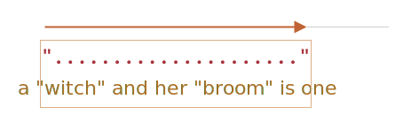

# Cuantificadores codiciosos y perezosos

Los cuantificadores son muy simples a primera vista, pero de hecho pueden ser complicados.

Debemos entender muy bien cómo funciona la búsqueda si planeamos buscar algo más complejo que `pattern:/\d+/`.

Tomemos la siguiente tarea como ejemplo.

Tenemos un texto y necesitamos reemplazar todas las comillas `"..."` con comillas latinas: `«...»`. En muchos paises los tipógrafos las prefieren.

Por ejemplo: `"Hola, mundo"` debe ser `«Hola, mundo»`. Existen otras comillas, como `„Witam, świat!”` (Polaco) o `「你好，世界」` (Chino), pero para nuestra tarea elegimos `«...»`.

Lo primero que debe hacer es ubicar las cadenas entre comillas, y luego podemos reemplazarlas.

Una expresión regular como `pattern:/".+"/g` (una comilla, después algo, luego otra comilla) Puede parecer una buena opción, ¡pero no lo es!

Vamos a intentarlo:

```js run
let regexp = /".+"/g;

let str = 'una "bruja" y su "escoba" son una';

alert( str.match(regexp) ); // "bruja" y su "escoba"
```

...¡Podemos ver que no funciona según lo previsto!

En lugar de encontrar dos coincidencias `match:"bruja"` y `match:"escoba"`, encuentra una: `match:"bruja" y su "escoba"`.

Esto se puede describir como "la codicia es la causa de todo mal".

## Búsqueda codiciosa

Para encontrar una coincidencia, el motor de expresión regular utiliza el siguiente algoritmo:

- Para cada posición en la cadena
    - Prueba si el patrón coincide en esta posición.
    - Si no hay coincidencia, ir a la siguiente posición.

Estas palabras comunes no son tan obvias para determinar por qué la regexp falla, así que elaboremos el funcionamiento de la búsqueda del patrón `pattern:".+"`.

1. El primer carácter del patrón es una comilla doble `pattern:"`.

    El motor de expresión regular intenta encontrarla en la posición cero de la cadena fuente `subject:una "bruja" y su "escoba" son una`, pero hay una `subject:u` allí, por lo que inmediatamente no hay coincidencia.

    Entonces avanza: va a la siguiente posición en la cadena fuente y prueba encontrar el primer carácter del patrón allí, falla de nuevo, y finalmente encuentra la comilla doble en la 3ra posición:

    

2. La comilla doble es detectada, y después el motor prueba encontrar una coincidencia para el resto del patrón. Prueba ver si el resto de la cadena objetivo satisface a `pattern:.+"`.

    En nuestro caso el próximo carácter de patrón es `pattern:.` (un punto). Que denota "cualquiere carácter excepto línea nueva", entonces la próxima letra de la cadena encaja `match:'w'`:

    

3. Entonces el punto (.) se repite por el cuantificador `pattern:.+`. El motor de expresión regular agrega a la coincidencia un carácter uno después de otro.

    ...¿Hasta cuando? Todos los caracteres coinciden con el punto, entonces se detiene hasta que alcanza el final de la cadena:

    

4. Ahora el motor finalizó el ciclo de `pattern:.+` y prueba encontrar el próximo carácter del patrón. El cual es la comilla doble `pattern:"`. Pero hay un problema: la cadena ha finalizado, ¡no hay más caracteres!

    El motor de expresión regular comprende que procesó demasiados `pattern:.+` y *reinicia* la cadena.

    En otras palabras, acorta la coincidencia para el cuantificador en un carácter:

    

    Ahora se supone que `pattern:.+` finaliza un carácter antes del final de la cadena e intenta hacer coincidir el resto del patrón desde esa posición.

    Si hubiera comillas doble allí, entonces la búsqueda terminaría, pero el último carácter es `subject:'a'`, por lo que no hay coincidencia.

5. ...Entonces el motor disminuye el número de repeticiones de `pattern:.+` en uno:

    

    Las comillas dobles `pattern:'"'` no coinciden con `subject:'n'`.

6. El motor continua reiniciando la lectura de la cadena: decrementa el contador de repeticiones para `pattern:'.'` hasta que el resto del patrón (en nuestro caso `pattern:'"'`) coincida:

    

7. La coincidencia está completa.

8. Entonces la primera coincidencia es `match:"bruja" y su "escoba"`. Si la expresión regular tiene la bandera `pattern:g`, entonces la búsqueda continuará desde donde termina la primera coincidencia. No hay más comillas dobles en el resto de la cadena `subject:son una`, entonces no hay más resultados.

Probablemente no es lo que esperabamos, pero así es como funciona.

**En el modo codicioso (por defecto) un carácter cuantificado se repite tantas veces como sea posible.**

El motor de regexp agrega a la coincidencia tantos caracteres como pueda abarcar el patrón `pattern:.+`, y luego los abrevia uno por uno si el resto del patrón no coincide.

En nuestro caso queremos otra cosa. Es entonces donde el modo perezoso puede ayudar.

## Modo perezoso

El modo perezoso de los cuantificadores es lo opuesto del modo codicioso. Eso significa: "repite el mínimo número de veces".

Podemos habilitarlo poniendo un signo de interrogación `pattern:'?'` después del cuantificador, entonces tendríamos `pattern:*?` o `pattern:+?` o incluso `pattern:??` para `pattern:'?'`.

Aclarando las cosas: generalmente un signo de interrogación `pattern:?` es un cuantificador por si mismo (cero o uno), pero si se agrega *despues de otro cuantificador (o incluso el mismo)* toma otro significado, alterna el modo de coincidencia de codicioso a perezoso.

La regexp `pattern:/".+?"/g` funciona como se esperaba: encuentra `match:"bruja"` y `match:"escoba"`:

```js run
let regexp = /".+?"/g;

let str = 'una "bruja" y su "escoba" son una';

alert( str.match(regexp) ); // "bruja", "escoba"
```

Para comprender claramente el cambio, rastreemos la búsqueda paso a paso.

1. El primer paso es el mismo: encuentra el inicio del patrón `pattern:'"'` en la 5ta posición:

    

2. El siguiente paso también es similar: el motor encuentra una coincidencia para el punto `pattern:'.'`:

    

3. Y ahora la búsqueda es diferente. Porque tenemos el modo perezoso activado en `pattern:+?`, el motor no prueba coincidir un punto una vez más, se detiene y prueba coincidir el resto del patrón (`pattern:'"'`) ahora mismo :

    

    Si hubiera comillas dobles allí, entonces la búsqueda terminaría, pero hay una `'r'`, entonces no hay coincidencia.
4. Después el motor de expresión regular incrementa el número de repeticiones para el punto y prueba una vez más:

    

    Falla de nuevo. Después el número de repeticiones es incrementado una y otra vez...
5. ...Hasta que se encuentre una coincidencia para el resto del patrón:

    

6. La próxima busqueda inicia desde el final de la coincidencia actual y produce un resultado más:

    

En este ejemplo vimos cómo funciona el modo perezoso para `pattern:+?`. Los cuantificadores `pattern:*?` y `pattern:??` funcionan de manera similar, el motor regexp incrementa el número de repticiones solo si el resto del patrón no coincide en la posición dada.

**La pereza solo está habilitada para el cuantificador con `?`.**

Otros cuantificadores siguen siendo codiciosos.

Por ejemplo:

```js run
alert( "123 456".match(/\d+ \d+?/) ); // 123 4
```

1. El patrón `pattern:\d+` intenta hacer coincidir tantos dígitos como sea posible (modo codicioso), por lo que encuentra  `match:123` y se detiene, porque el siguiente carácter es un espacio `pattern:' '`.
2. Luego hay un espacio en el patrón, coincide.
3. Después hay un `pattern:\d+?`. El cuantificador está en modo perezoso, entonces busca un dígito `match:4` y trata de verificar si el resto del patrón coincide desde allí.

    ...Pero no hay nada en el patrón después de `pattern:\d+?`.

    El modo perezoso no repite nada sin necesidad. El patrón terminó, así que terminamos. Tenemos una coincidencia `match:123 4`.

```smart header="Optimizaciones"
Los motores modernos de expresiones regulares pueden optimizar algoritmos internos para trabajar más rápido. Estos trabajan un poco diferente del algoritmo descrito.

Pero para comprender como funcionan las expresiones regulares y construirlas, no necesitamos saber nada al respecto. Solo se usan internamente para optimizar cosas.

Las expresiones regulares complejas son difíciles de optimizar, por lo que la búsqueda también puede funcionar exactamente como se describe.
```

## Enfoque alternativo

Con las regexps, por lo general hay muchas formas de hacer la misma cosa.

En nuestro caso podemos encontrar cadenas entre comillas sin el modo perezoso usando la regexp `pattern:"[^"]+"`:

```js run
let regexp = /"[^"]+"/g;

let str = 'una "bruja" y su "escoba" son una';

alert( str.match(regexp) ); // "bruja", "escoba"
```

La regexp `pattern:"[^"]+"` devuelve el resultado correcto, porque busca una comilla doble `pattern:'"'` seguida por uno o más caracteres no comilla doble `pattern:[^"]`, y luego la comilla doble de cierre.

Cuando la máquina de regexp busca el carácter no comilla `pattern:[^"]+` se detiene la repetición cuando encuentra la comilla doble de cierre,y terminamos.

Nótese, ¡esta lógica no reemplaza al cuantificador perezoso!

Es solo diferente. Hay momentos en que necesitamos uno u otro.

**Veamos un ejemplo donde los cuantificadores perezosos fallan y la variante funciona correctamente.**

Por ejemplo, queremos encontrar enlaces en la forma `<a href="..." class="doc">`, con cualquier `href`.

¿Cual expresión regular usamos?

La primera idea podría ser: `pattern:/<a href=".*" class="doc">/g`.

Veámoslo:
```js run
let str = '...<a href="link" class="doc">...';
let regexp = /<a href=".*" class="doc">/g;

// ¡Funciona!
alert( str.match(regexp) ); // <a href="link" class="doc">
```

Funcionó. Pero veamos ¿que pasa si hay varios enlaces en el texto?

```js run
let str = '...<a href="link1" class="doc">... <a href="link2" class="doc">...';
let regexp = /<a href=".*" class="doc">/g;

// ¡Vaya! ¡Dos enlaces en una coincidencia!
alert( str.match(regexp) ); // <a href="link1" class="doc">... <a href="link2" class="doc">
```

Ahora el resultado es incorrecto por la misma razón del ejemplo de la bruja. El cuantificador `pattern:.*` toma demasiados caracteres.

La coincidencia se ve así:

```html
<a href="....................................." class="doc">
<a href="link1" class="doc">... <a href="link2" class="doc">
```

Modifiquemos el patrón haciendo el cuantificador perezoso: `pattern:.*?`:

```js run
let str = '...<a href="link1" class="doc">... <a href="link2" class="doc">...';
let regexp = /<a href=".*?" class="doc">/g;

// ¡Funciona!
alert( str.match(regexp) ); // <a href="link1" class="doc">, <a href="link2" class="doc">
```

Ahora parece funcionar, hay dos coincidencias:

```html
<a href="....." class="doc">    <a href="....." class="doc">
<a href="link1" class="doc">... <a href="link2" class="doc">
```

...Pero probemos ahora con una entrada de texto adicional:

```js run
let str = '...<a href="link1" class="wrong">... <p style="" class="doc">...';
let regexp = /<a href=".*?" class="doc">/g;

// ¡Coincidencia incorrecta!
alert( str.match(regexp) ); // <a href="link1" class="wrong">... <p style="" class="doc">
```

Ahora falla. La coincidencia no solo incluye el enlace, sino también mucho texto después, incluyendo `<p...>`.

¿Por qué?

Eso es lo que está pasando:

1. Primero la regexp encuentra un enlace inicial `match:<a href="`.
2. Después busca para el patrón `pattern:.*?`: toma un carácter (¡perezosamente!), verifica si hay una coincidencia para `pattern:" class="doc">` (ninguna).
3. Después toma otro carácter dentro de `pattern:.*?`, y así... hasta que finalmente alcanza a  `match:" class="doc">`.

Pero el problema es que: eso ya está más allá del enlace `<a...>`, en otra etiqueta `<p>`. No es lo que queremos.

Esta es la muestra de la coincidencia alineada con el texto:

```html
<a href="..................................." class="doc">
<a href="link1" class="wrong">... <p style="" class="doc">
```

Entonces, necesitamos un patrón que busque `<a href="...algo..." class="doc">`, pero ambas variantes, codiciosa y perezosa, tienen problemas.

La variante correcta puede ser: `pattern:href="[^"]*"`. Esta tomará todos los caracteres dentro del atributo `href` hasta la comilla doble más cercana, justo lo que necesitamos.

Un ejemplo funcional:

```js run
let str1 = '...<a href="link1" class="wrong">... <p style="" class="doc">...';
let str2 = '...<a href="link1" class="doc">... <a href="link2" class="doc">...';
let regexp = /<a href="[^"]*" class="doc">/g;

// ¡Funciona!
alert( str1.match(regexp) ); // null, sin coincidencia, eso es correcto
alert( str2.match(regexp) ); // <a href="link1" class="doc">, <a href="link2" class="doc">
```

## Resumen

Los cuantificadores tienen dos modos de funcionamiento:

Codiciosa
: Por defecto el motor de expresión regular prueba repetir el carácter cuantificado tantas veces como sea posible. Por ejemplo, `pattern:\d+` consume todos los posibles dígitos. Cuando es imposible consumir más (no hay más dígitos o es el fin de la cadena), entonces continúa hasta coincidir con el resto del patrón. Si no hay coincidencia entonces se decrementa el número de repeticiones (reinicios) y prueba de nuevo.

Perezoso
: Habilitado por el signo de interrogación `pattern:?` después de un cuantificador. El motor de regexp prueba la coincidencia para el resto del patrón antes de cada repetición del carácter cuantificado.

Como vimos, el modo perezoso no es una "panacea" de la búsqueda codiciosa. Una alternativa es una búsqueda codiciosa refinada, con exclusiones, como en el patrón `pattern:"[^"]+"`.
